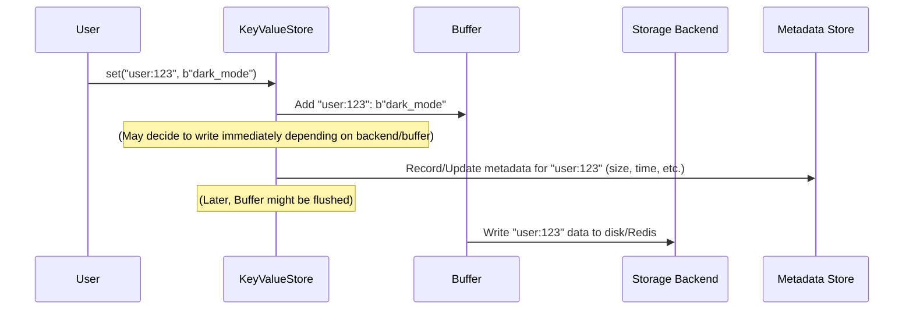

# Chapter 1: KeyValueStore - Your Front Desk to NADB

Welcome to NADB! If you need a simple way to store and retrieve pieces of information (like saving user preferences, caching data, or tracking task details), you're in the right place.

Imagine you have a large warehouse full of items. To keep things organized, every item needs a unique label, and you need a system to put items onto shelves, find them later using their label, or remove them when they're no longer needed.

NADB helps you manage digital information like that warehouse. The main component you'll interact with is the `KeyValueStore`. Think of it as the **front desk** of your digital warehouse. It's where you go to:

1.  **Store (`set`)** an item (your data, called a "value") with a unique label (called a "key").
2.  **Retrieve (`get`)** an item using its unique label (key).
3.  **Remove (`delete`)** an item using its unique label (key).

The `KeyValueStore` handles all the basic interactions and coordinates with other parts of NADB behind the scenes to manage things efficiently. Let's see how to use it!

## Getting Started: Setting Up Your Store

First, you need to import the `KeyValueStore` class. You'll also need something called `KeyValueSync`, which helps manage saving data in the background. We'll cover `KeyValueSync` in more detail later in [Chapter 7: KeyValueSync](07_keyvaluesync_.md), but for now, just know you need to create one and pass it to your store.

```python
# Import the necessary classes
from nadb import KeyValueStore, KeyValueSync

# Create a sync manager (runs in the background)
# We'll use a simple interval for now
kv_sync = KeyValueSync(flush_interval_seconds=5)
kv_sync.start() # Start the background process

# Now, create your KeyValueStore instance
# You need to tell it where to store data on disk
data_folder = "./my_nadb_data"
my_store = KeyValueStore(
    data_folder_path=data_folder,
    db="my_first_db",          # A name for your database space
    namespace="user_profiles", # A sub-category within the db
    buffer_size_mb=1,          # How much data to keep in memory (explained later)
    sync=kv_sync               # The sync manager we created
    # storage_backend="fs"     # Default is filesystem, covered in Chapter 5
)

print("KeyValueStore created!")

# It's good practice to ensure sync stops when your app exits
import atexit
atexit.register(kv_sync.sync_exit)
```

In this code:

1.  We import `KeyValueStore` and `KeyValueSync`.
2.  We create a `KeyValueSync` instance. This helper runs in the background to periodically save buffered data.
3.  We create the `KeyValueStore`, giving it:
    *   `data_folder_path`: A directory where NADB will physically store files.
    *   `db`: A name for the database (like a specific warehouse building).
    *   `namespace`: A sub-section within the database (like an aisle or floor in the warehouse). Using `db` and `namespace` helps keep data separate if you use NADB for multiple purposes.
    *   `buffer_size_mb`: How much data (in megabytes) to temporarily hold in memory before writing to disk. We'll discuss this in [Chapter 6: Data Buffering & Flushing](06_data_buffering___flushing_.md).
    *   `sync`: The `KeyValueSync` instance we created earlier.
4.  We register `kv_sync.sync_exit` to run when the program exits, ensuring any buffered data gets saved.

## Basic Operations: Set, Get, Delete

Now that we have our `my_store` object (our front desk), let's use it!

### Storing Data (`set`)

To store data, you use the `.set()` method. You need a unique **key** (a string label) and the **value** (your data, which *must* be in bytes).

```python
# Let's store a user's preferred theme
user_id = "user:123"
theme_preference = b"dark_mode" # Data must be bytes!

my_store.set(user_id, theme_preference)

print(f"Stored data for key: {user_id}")
# Expected Output: Stored data for key: user:123
```

Here, `"user:123"` is our unique key, and `b"dark_mode"` is the value (notice the `b` prefix making it bytes). NADB takes this information and prepares it for storage.

### Retrieving Data (`get`)

To get the data back, use the `.get()` method with the key you used to store it.

```python
# Retrieve the theme preference for user:123
user_id = "user:123"

try:
    retrieved_value = my_store.get(user_id)
    # Remember, the value is always bytes, decode if it's text
    print(f"Retrieved value: {retrieved_value.decode('utf-8')}")
    # Expected Output: Retrieved value: dark_mode
except KeyError:
    print(f"Key '{user_id}' not found.")
```

We use the same key, `"user:123"`, and `get()` returns the bytes we stored earlier. Since we know it was text, we use `.decode('utf-8')` to convert it back to a string for printing. If the key didn't exist, `get()` would raise a `KeyError`, so it's good practice to wrap it in a `try...except` block.

### Removing Data (`delete`)

If you no longer need the data, use the `.delete()` method with the key.

```python
# Remove the theme preference for user:123
user_id = "user:123"

my_store.delete(user_id)
print(f"Deleted data for key: {user_id}")

# Let's try retrieving it again
try:
    retrieved_value = my_store.get(user_id)
    print(f"Retrieved value after delete: {retrieved_value.decode('utf-8')}")
except KeyError:
    print(f"Key '{user_id}' not found after deletion.")
    # Expected Output: Key 'user:123' not found after deletion.
```

After calling `delete()`, trying to `get()` the same key results in a `KeyError`, confirming the data has been removed.

## Under the Hood: How KeyValueStore Works

When you call methods like `set()`, `get()`, or `delete()`, the `KeyValueStore` doesn't always immediately write to or read from the disk. It often uses a temporary memory **buffer** for speed and coordinates with other components.

Here's a simplified view of what happens when you call `my_store.set("user:123", b"dark_mode")`:



1.  **You** call `set()` on the `KeyValueStore`.
2.  **KeyValueStore** might place the key and value into an in-memory [Buffer](06_data_buffering___flushing_.md). This is very fast. (Some backends like Redis might write immediately).
3.  **KeyValueStore** updates information *about* your data (like when it was created/updated, its size) in the [Metadata Store](08_keyvaluemetadata_.md).
4.  Later (or immediately), the data from the buffer is written to the actual persistent [Storage Backend](05_storage_backends__filesystemstorage__redisstorage_.md) (like the computer's file system or a Redis server), possibly compressing it first.

Let's peek at some (simplified) internal code snippets from `nakv.py`:

**Initialization (`__init__`)**

```python
# Simplified from nakv.py - KeyValueStore.__init__ (v2.2.0)
class KeyValueStore:
    def __init__(self, data_folder_path: str, db: str, buffer_size_mb: float,
                 namespace: str, sync: KeyValueSync, storage_backend: str = "fs"):
        self.data_folder_path = data_folder_path
        self.db = db
        self.namespace = namespace
        self.buffer = {}  # The in-memory buffer (a dictionary)
        self.current_buffer_size = 0
        self.buffer_size_mb = buffer_size_mb

        # Creates the actual storage mechanism (e.g., FileSystemStorage)
        # See Chapter 4 & 5
        self.storage = StorageFactory.create_storage(storage_backend, ...)

        # NEW in v2.2.0: Get backend capabilities
        self.capabilities = self.storage.get_capabilities()

        # Determine if we should use buffering based on backend capabilities
        self.use_buffering = self.capabilities.supports_buffering and \
                            self.capabilities.write_strategy != "immediate"

        # Manages metadata (unless backend supports it natively)
        # See Chapter 8
        if not self.capabilities.supports_metadata:
            self.metadata = KeyValueMetadata(...) # SQLite for FS backend
        else:
            self.metadata = None # Redis handles metadata internally

        # ... other setup ...
        self.sync = sync
        sync.register_store(self) # Tell the sync manager about this store
```

When you create a `KeyValueStore`, it sets up its internal `buffer`, figures out which [Storage Backend](13_backend_capabilities_system.md) to use via the [StorageFactory](04_storagefactory_.md), and **queries the backend's capabilities** (new in v2.2.0). Based on these capabilities, it automatically adapts its behavior - for example, using buffering for filesystem but writing immediately for Redis.

**Storing Data (`set`)**

```python
# Simplified from nakv.py - KeyValueStore.set (v2.2.0)
def set(self, key: str, value: bytes, tags: list = None):
    # ... (Input validation) ...
    with self._get_lock(key): # Ensures only one thread modifies this key at a time
        # NEW in v2.2.0: Unified write strategies
        if self.use_buffering:
            # Strategy 1: Buffered write (filesystem backend)
            self._buffered_set(key, value, tags)
        else:
            # Strategy 2: Immediate write (Redis backend)
            self._immediate_set(key, value, tags)
    # ... (Record performance metrics) ...

def _buffered_set(self, key: str, value: bytes, tags: list = None):
    """Buffered write - add to memory buffer first."""
    self.buffer[key] = value
    self.current_buffer_size += len(value)
    self._set_metadata(...)  # Unified metadata interface
    self.flush_if_needed()

def _immediate_set(self, key: str, value: bytes, tags: list = None):
    """Immediate write - write directly to storage."""
    data_to_write = self._compress_data(value)
    self.storage.write_data(path, data_to_write)
    self._set_metadata(...)  # Unified metadata interface
```

The `set` method now uses **unified write strategies** (v2.2.0). Instead of checking backend type, it consults `self.use_buffering` (determined by backend capabilities) and calls the appropriate strategy method. Both strategies use a unified `_set_metadata()` interface that works regardless of backend.

**Getting Data (`get`)**

```python
# Simplified from nakv.py - KeyValueStore.get (v2.2.0)
def get(self, key: str):
    # ... (Input validation, start timer) ...
    with self._get_lock(key):
        # 1. Check the fast in-memory buffer first
        if key in self.buffer:
            return self.buffer[key]

        # 2. If not in buffer, check metadata to see if key exists
        # NEW in v2.2.0: Unified metadata interface
        metadata = self._get_metadata(key) # Works for all backends

        if not metadata:
            raise KeyError(f"Key '{key}' not found") # Key doesn't exist

        # 3. Read data from the actual storage (disk/Redis)
        path = metadata["path"]
        value = self.storage.read_data(path)

        # 4. Decompress if needed
        value = self._decompress_data(value)

    # ... (Record metrics, update last accessed time in metadata) ...
    return value
```

The `get` method uses a lock and smartly checks the fast memory `buffer` first. If data isn't there, it uses the **unified metadata interface** `_get_metadata()` (v2.2.0) which works identically for all backends. It then reads from the [Storage Backend](13_backend_capabilities_system.md), decompresses if necessary, and returns the value.

## Conclusion

You've learned about the `KeyValueStore`, the main entry point for NADB. It acts like a front desk, allowing you to `set` (store), `get` (retrieve), and `delete` data using unique keys. You saw how to initialize it and perform these basic operations. We also briefly looked under the hood to understand how it coordinates with buffering, storage, and metadata management.

While keys and values are great for simple storage, sometimes you want to find items based on categories or properties rather than just their exact key. That's where tags come in!

Ready to learn how to organize and query your data more flexibly? Let's move on to [Chapter 2: Tags](02_tags_.md).

---
