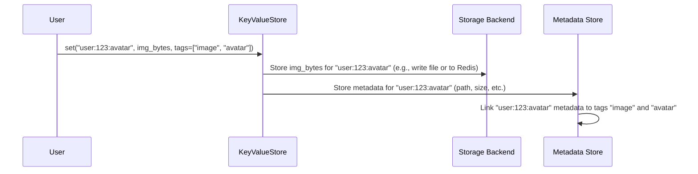
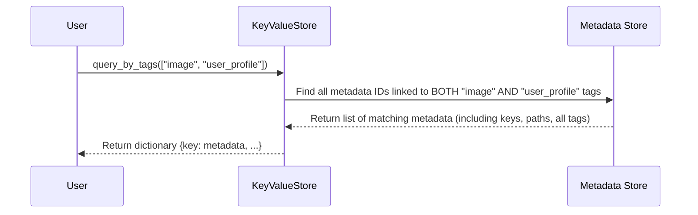

# Chapter 2: Tags - Organizing Your Data

In [Chapter 1: KeyValueStore](01_keyvaluestore_.md), we learned how to use the `KeyValueStore` like a front desk to store (`set`), retrieve (`get`), and remove (`delete`) data using unique keys. This is great when you know the exact label (key) of the item you need.

But what if you want to find items based on their *category* or *properties*? Imagine our warehouse again. You know you need all the boxes marked 'fragile', or all the boxes containing 'electronics'. You don't know their exact unique labels (keys), but you know something *about* them. This is where tags come in handy!

## What are Tags?

Tags are like **labels** or **keywords** you can attach to your key-value pairs when you store them. Think of them as colored stickers you put on your warehouse boxes:

*   Red sticker: 'Urgent'
*   Blue sticker: 'Requires Refrigeration'
*   Yellow sticker: 'Fragile'

A single box might have multiple stickers. In NADB, a single key-value pair can have multiple tags.

Using tags allows you to:

1.  **Categorize** your data (e.g., 'user_profile', 'product_image', 'cache_data').
2.  **Mark** data with certain properties (e.g., 'urgent', 'processed', 'needs_review').
3.  **Query** your store later to find all items that share specific tags (e.g., find all keys tagged 'urgent' AND 'image').

## Using Tags

Adding tags is simple – you just provide a list of strings when you `set` your data.

### Adding Tags When Storing Data

Let's modify our example from Chapter 1. We'll store a user's profile picture and tag it appropriately.

```python
# Assuming my_store is already set up from Chapter 1
# (Make sure kv_sync is running if you restart the script)

# Let's store a user's avatar image (imagine these are the image bytes)
user_avatar_key = "user:123:avatar"
avatar_image_bytes = b"<pretend this is jpeg data>"

# Define the tags as a list of strings
image_tags = ["user_profile", "image", "avatar", "priority:medium"]

# Use the 'tags' parameter in the set method
my_store.set(user_avatar_key, avatar_image_bytes, tags=image_tags)

print(f"Stored '{user_avatar_key}' with tags: {image_tags}")
# Expected Output: Stored 'user:123:avatar' with tags: ['user_profile', 'image', 'avatar', 'priority:medium']

# Let's store another user's banner image
user_banner_key = "user:456:banner"
banner_image_bytes = b"<pretend this is png data>"
banner_tags = ["user_profile", "image", "banner", "priority:low"]
my_store.set(user_banner_key, banner_image_bytes, tags=banner_tags)

print(f"Stored '{user_banner_key}' with tags: {banner_tags}")
# Expected Output: Stored 'user:456:banner' with tags: ['user_profile', 'image', 'banner', 'priority:low']
```

In this code, we added the optional `tags` argument to the `set` method. It's just a list of strings that describe the data. NADB takes care of storing these tags along with the data.

### Finding Data Using Tags

Now, the powerful part! Let's say we want to find all items that are tagged as both 'user_profile' and 'image'. We use the `query_by_tags()` method.

```python
# Query for items tagged with 'user_profile' AND 'image'
query_tags = ["user_profile", "image"]
tagged_items = my_store.query_by_tags(query_tags)

print(f"\nFound {len(tagged_items)} items with tags {query_tags}:")

# The result is a dictionary where keys are the data keys,
# and values are the full metadata for each key (including all its tags).
for key, metadata in tagged_items.items():
    print(f"  Key: {key}")
    print(f"    Tags: {metadata.get('tags', [])}")
    print(f"    Size: {metadata.get('size', 'N/A')} bytes")
    # You can access other metadata like 'created_at', 'last_updated', etc.

# Example Output (order might vary):
# Found 2 items with tags ['user_profile', 'image']:
#   Key: user:123:avatar
#     Tags: ['user_profile', 'image', 'avatar', 'priority:medium']
#     Size: <some number> bytes
#   Key: user:456:banner
#     Tags: ['user_profile', 'image', 'banner', 'priority:low']
#     Size: <some number> bytes

# Query for items tagged 'avatar'
avatar_items = my_store.query_by_tags(["avatar"])
print(f"\nFound {len(avatar_items)} items with tag 'avatar':")
for key, metadata in avatar_items.items():
    print(f"  Key: {key}, Tags: {metadata.get('tags', [])}")
# Example Output:
# Found 1 items with tag 'avatar':
#   Key: user:123:avatar, Tags: ['user_profile', 'image', 'avatar', 'priority:medium']

# Query for tags that don't match anything
urgent_images = my_store.query_by_tags(["image", "urgent"])
print(f"\nFound {len(urgent_images)} items with tags ['image', 'urgent']")
# Example Output:
# Found 0 items with tags ['image', 'urgent']
```

The `query_by_tags()` method takes a list of tags. It finds all keys that have **all** the tags in the provided list (it's an "AND" search). The result is a dictionary where:

*   The **keys** of the dictionary are the original keys of your data (like `"user:123:avatar"`).
*   The **values** of the dictionary are themselves dictionaries containing the *metadata* for that key. This metadata includes the path where the data is stored, its size, creation/update times, and importantly, *all* the tags associated with it.

You can also see all the tags currently used in your store:

```python
all_tags_in_store = my_store.list_all_tags()
print(f"\nAll unique tags currently in the store: {all_tags_in_store}")
# Example Output (might show counts depending on backend):
# All unique tags currently in the store: {'user_profile': 2, 'image': 2, 'avatar': 1, 'priority:medium': 1, 'banner': 1, 'priority:low': 1}
```

## Under the Hood: How Tags are Managed

When you add tags, NADB needs to store this information so it can be searched later. This involves coordination between the `KeyValueStore` and the underlying metadata/storage layers.

**Storing with Tags:**

When you call `my_store.set(key, value, tags=[...])`:



1.  The `KeyValueStore` receives the key, value, and tags.
2.  It tells the [Storage Backend](05_storage_backends__filesystemstorage__redisstorage_.md) (like the filesystem or Redis) to store the actual data (`img_bytes`).
3.  It tells the [Metadata Store](08_keyvaluemetadata_.md) (like an SQLite database or Redis hashes/sets) to record information *about* the key (like where the data is stored, its size, timestamps).
4.  Crucially, the Metadata Store also records the association between this key and the provided tags (`"image"`, `"avatar"`). This might involve adding entries to a special linking table (in SQLite) or adding the key to tag-specific sets (in Redis).

**Querying by Tags:**

When you call `my_store.query_by_tags(["image", "user_profile"])`:



1.  The `KeyValueStore` receives the list of tags to query.
2.  It asks the [Metadata Store](08_keyvaluemetadata_.md) to find all the stored items that are associated with *every single tag* in the query list.
3.  The Metadata Store performs the search (e.g., using SQL `JOIN`s or Redis `SINTER` - set intersection) and returns the full metadata for all matching items.
4.  The `KeyValueStore` formats this into the result dictionary and returns it to you.

### Code Glimpse

Let's look at simplified snippets showing how this works.

**Inside `KeyValueStore.set` (from `nakv.py`):**

```python
# Simplified from nakv.py - KeyValueStore.set (v2.2.0)
def set(self, key: str, value: bytes, tags: list = None):
    # ... (Checks and locking) ...

    # Prepare metadata dictionary including tags
    metadata_dict = {
        "path": self._get_path(key),
        "key": key,
        "db": self.db,
        "namespace": self.namespace,
        "size": len(value), # Store original size
        "ttl": None,
        # Include tags if provided!
        "tags": tags if tags else []
    }

    # NEW in v2.2.0: Unified write strategies based on capabilities
    if self.use_buffering:
        # Buffered write (filesystem backend)
        self.buffer[key] = value
        self.current_buffer_size += len(value)
        self._set_metadata(metadata_dict)  # Unified metadata interface!
        self.flush_if_needed()
    else:
        # Immediate write (Redis backend)
        data_to_write = self._compress_data(value)
        success = self.storage.write_data(path, data_to_write)
        if success:
            self._set_metadata(metadata_dict)  # Unified metadata interface!

    # ... (Record metrics) ...
```

The `set` method takes the optional `tags` list, includes it in the `metadata_dict`. In v2.2.0, it uses **unified write strategies** and calls `_set_metadata()` which automatically routes to the correct metadata handler based on backend capabilities.

**Inside `KeyValueStore.query_by_tags` (from `nakv.py`):**

```python
# Simplified from nakv.py - KeyValueStore.query_by_tags (v2.2.0)
def query_by_tags(self, tags: list):
    # ... (Start timer) ...

    # Prepare the query dictionary
    query = {
        "db": self.db,
        "namespace": self.namespace,
        "tags": tags # The list of tags to search for
    }

    # NEW in v2.2.0: Unified metadata query interface
    results = self._query_metadata(query)  # Works with all backends!

    # Format the results into the expected dictionary {key: metadata}
    keys_metadata = {}
    for metadata_entry in results:
        keys_metadata[metadata_entry["key"]] = metadata_entry

    # ... (Record metrics) ...
    return keys_metadata
```

This method packages the query criteria (including the `tags` list) and calls `_query_metadata()` which automatically routes to the correct metadata handler based on backend capabilities (v2.2.0).

**Inside `KeyValueMetadata.query_metadata` (for SQLite backend, simplified):**

```python
# Simplified from nakv.py - KeyValueMetadata.query_metadata
def query_metadata(self, query: dict) -> list:
    conditions = []
    params = []
    # ... (Handle other query fields like db, namespace, size...) ...

    # Handle tag filters
    if 'tags' in query and query['tags']:
        tag_conditions = []
        for tag in query['tags']:
            # This subquery finds metadata IDs linked to a specific tag name
            tag_subquery = """
                m.id IN (
                    SELECT metadata_id
                    FROM metadata_tags mt JOIN tags t ON mt.tag_id = t.id
                    WHERE t.tag_name = ?
                )
            """
            tag_conditions.append(tag_subquery)
            params.append(tag)

        # Combine all tag conditions with AND to ensure all tags match
        conditions.append(f"({' AND '.join(tag_conditions)})")

    # Build the main SQL query (simplified)
    sql = """
        SELECT m.*, GROUP_CONCAT(t.tag_name) as tags
        FROM metadata m
        LEFT JOIN metadata_tags mt ON m.id = mt.metadata_id
        LEFT JOIN tags t ON mt.tag_id = t.id
    """
    if conditions:
        sql += f" WHERE {' AND '.join(conditions)}"
    sql += " GROUP BY m.id"

    # Execute query and fetch results...
    # ... (Code to run SQL query with params and format rows) ...
    # Return list of metadata dictionaries
```

When using the filesystem backend, the `KeyValueMetadata` class uses SQLite. To handle tags, it dynamically builds an SQL query. For each tag in the `query['tags']` list, it adds a subquery condition ensuring the metadata entry is linked to that tag via the `metadata_tags` linking table. These conditions are joined with `AND`, so only entries matching *all* specified tags are returned. The `GROUP_CONCAT` function gathers all associated tags for each matching entry. (The Redis backend uses Redis sets and commands like `SINTER` to achieve a similar result efficiently).

## Conclusion

Tags provide a flexible way to categorize and query your data in NADB. Instead of only relying on unique keys, you can attach descriptive labels (tags) and later find items based on these labels using `query_by_tags()`. This makes it much easier to manage and retrieve related pieces of information, like finding all images, all urgent tasks, or all user profiles.

We've seen how to add tags when storing data and how to use `query_by_tags` to find data. We also peeked under the hood to see how NADB manages these tag associations using its metadata layer.

Organizing data is one challenge, but managing its lifecycle is another. What if you only need data to be stored for a limited time, like cache entries? That's where Time-To-Live (TTL) comes in.

Let's learn how to automatically expire data in [Chapter 3: TTL (Time-To-Live)](03_ttl__time_to_live__.md).

---
