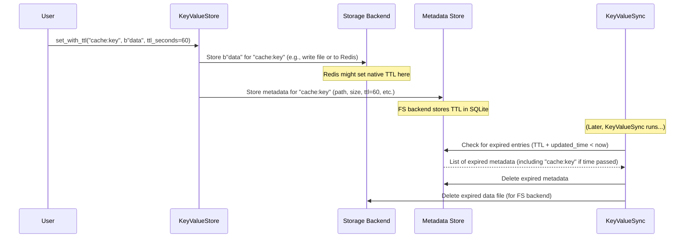

# Chapter 3: TTL (Time-To-Live)

In [Chapter 2: Tags](02_tags_.md), we saw how to add labels to our data to make it easier to find related items using `query_by_tags()`. This helps organize information. But what about data that you only need for a short while?

Imagine you're storing temporary information, like the results of a recent web search that you want to show quickly if the user searches again soon. Or perhaps you're tracking a user's session information that should automatically disappear after they've been inactive for 30 minutes. You don't want this temporary data cluttering up your storage forever!

This is where **TTL (Time-To-Live)** comes in.

## What is TTL?

TTL lets you set an **expiration time** (in seconds) for a key-value pair when you store it. It's like putting a "discard after this time" sticker on an item in our warehouse.

After the specified number of seconds passes, NADB will automatically recognize that the data is expired.

*   If you're using the **FileSystemStorage** backend (the default), the background [KeyValueSync](07_keyvaluesync_.md) process will periodically check the [KeyValueMetadata](08_keyvaluemetadata_.md) and remove the expired key and its associated data file.
*   If you're using the **RedisStorage** backend, Redis itself handles the expiration automatically.

This is incredibly useful for things like:

*   **Caching:** Storing temporary results of calculations or database queries.
*   **Session Data:** Holding user login information that expires after inactivity.
*   **Temporary Locks:** Marking a resource as "in use" for a limited time.

## Using TTL: Setting an Expiration Date

To set a TTL, you use a special method called `set_with_ttl()` instead of the regular `set()`. You provide the key, the value (as bytes), and the `ttl_seconds` (how long the data should live).

Let's store a temporary cache entry that should expire after 60 seconds.

```python
# Assuming my_store is already set up from Chapter 1 or 2
# (Make sure kv_sync is running if you restart the script)

cache_key = "search_results:latest_query"
# Imagine these are the search results
cache_value = b'{"results": ["item1", "item2"], "timestamp": 1678886400}'
expiration_time_seconds = 60 # Expire after 1 minute

# Store the data with a TTL of 60 seconds
my_store.set_with_ttl(cache_key, cache_value, ttl_seconds=expiration_time_seconds)

print(f"Stored '{cache_key}' with a TTL of {expiration_time_seconds} seconds.")
# Expected Output: Stored 'search_results:latest_query' with a TTL of 60 seconds.
```

It's just like `set()`, but with the added `ttl_seconds` argument. NADB now knows this data is temporary.

## What Happens When Time Runs Out?

Let's see TTL in action. We'll set a very short TTL (5 seconds) and try to retrieve the data before and after it expires.

```python
import time

short_ttl_key = "temp:user_action"
short_ttl_value = b"user clicked submit"
short_ttl_seconds = 5 # Expire very quickly

my_store.set_with_ttl(short_ttl_key, short_ttl_value, ttl_seconds=short_ttl_seconds)
print(f"Stored '{short_ttl_key}' with TTL {short_ttl_seconds}s.")

# Try to get it immediately
try:
    value_before = my_store.get(short_ttl_key)
    print(f"Retrieved immediately: {value_before.decode()}")
    # Expected Output: Retrieved immediately: user clicked submit
except KeyError:
    print("Key not found immediately (unexpected!).")

# Wait for longer than the TTL
wait_time = short_ttl_seconds + 1 # Wait 6 seconds
print(f"\nWaiting for {wait_time} seconds...")
time.sleep(wait_time)

# Now try to get it again
print("Attempting retrieval after TTL expiration...")
try:
    value_after = my_store.get(short_ttl_key)
    print(f"Retrieved after expiration: {value_after.decode()} (This shouldn't happen!)")
except KeyError:
    print(f"Key '{short_ttl_key}' not found after expiration (as expected!).")
    # Expected Output: Key 'temp:user_action' not found after expiration (as expected!).
```

1.  We store the data with a 5-second TTL using `set_with_ttl()`.
2.  We immediately retrieve it using `get()`, and it works fine.
3.  We wait for 6 seconds, which is longer than the TTL.
4.  We try to retrieve it again. This time, `get()` raises a `KeyError` because the data has expired and has been (or will soon be) cleaned up by the system.

*Note:* With the FileSystem backend, the actual deletion happens during the next cleanup cycle run by [KeyValueSync](07_keyvaluesync_.md). So, there might be a slight delay between the TTL technically expiring and the `KeyError` being raised. With Redis, the expiration is usually immediate.

You can also add tags when using TTL:

```python
my_store.set_with_ttl(
    "cache:user:123:profile",
    b'{"name": "Alice"}',
    ttl_seconds=300, # 5 minutes
    tags=["cache", "user_profile"]
)
print("Stored user profile cache with TTL and tags.")
```

## Under the Hood: How TTL is Managed

When you call `set_with_ttl()`, NADB needs to remember not just the data, but also its expiration deadline.

**Storing with TTL:**



1.  You call `set_with_ttl()` on the [KeyValueStore](01_keyvaluestore_.md).
2.  The `KeyValueStore` tells the [Storage Backend](05_storage_backends__filesystemstorage__redisstorage__.md) to store the actual data.
    *   If using **RedisStorage**, it tells Redis to store the data *and* set Redis's built-in expiration time.
3.  The `KeyValueStore` tells the [Metadata Store](08_keyvaluemetadata_.md) to record information about the key, including the `ttl_seconds`.
    *   If using **FileSystemStorage**, the TTL value is saved in the SQLite metadata database alongside other details like the file path and size.
4.  **Later (for FileSystemStorage):** The background [KeyValueSync](07_keyvaluesync_.md) process periodically asks the `KeyValueMetadata` system to find entries whose `last_updated` time plus their `ttl` is now in the past.
5.  If expired entries are found, `KeyValueSync` tells the `KeyValueMetadata` to remove the metadata record and tells the `FileSystemStorage` to delete the corresponding data file.

### Code Glimpse

Let's look at simplified snippets.

**Inside `KeyValueStore.set_with_ttl` (from `nakv.py`):**

```python
# Simplified from nakv.py - KeyValueStore.set_with_ttl
def set_with_ttl(self, key: str, value: bytes, ttl_seconds: int, tags: list = None):
    # ... (Input checks) ...
    start_time = time.time()

    with self._get_lock(key): # Ensure thread safety
        # Prepare metadata, including the TTL
        metadata = {
            "path": self._get_path(key),
            "key": key,
            "db": self.db,
            "namespace": self.namespace,
            "size": len(value),
            "ttl": ttl_seconds # Store the TTL!
        }
        if tags:
            metadata["tags"] = tags

        if self.is_redis_backend:
            # Redis handles TTL natively, write data immediately
            path = metadata["path"]
            data_to_write = self._compress_data(value)
            success = self.storage.write_data(path, data_to_write)
            if success:
                # Pass metadata (with TTL) to Redis storage backend
                # It will set TTL on both data and metadata keys in Redis
                self.storage.set_metadata(metadata)
        else:
            # Filesystem backend: Add to buffer and update SQLite metadata
            self.buffer[key] = value # Add data to buffer
            self.current_buffer_size += len(value)
            # Pass metadata (with TTL) to the SQLite metadata handler
            self.metadata.set_metadata(metadata)
            # Check if buffer needs flushing
            self.flush_if_needed()

    # ... (Record metrics) ...
```

This method is similar to `set()`, but it crucially includes the `ttl_seconds` in the `metadata` dictionary. It then passes this metadata (including the TTL) to the appropriate handler (`self.storage.set_metadata` for Redis, which sets the native Redis TTL, or `self.metadata.set_metadata` for the filesystem backend, which stores the TTL value in SQLite).

**Inside `KeyValueMetadata.set_metadata` (for FS/SQLite, simplified from `nakv.py`):**

```python
# Simplified from nakv.py - KeyValueMetadata.set_metadata
def set_metadata(self, metadata: dict):
    # ... (Checks if record exists) ...
    db = self._get_db_connection()
    with self.connection_lock:
        if existing_record:
            # Update existing record
            sql = '''UPDATE metadata SET last_updated=?, size=?, ttl=? WHERE ...'''
            params = (datetime.now(), metadata.get("size"), metadata.get("ttl"), ...)
            db.execute(sql, params)
            metadata_id = existing_id
        else:
            # Insert new record
            sql = '''INSERT INTO metadata (... size, ttl) VALUES (?, ?, ?, ?)'''
            params = (..., metadata.get("size"), metadata.get("ttl")) # Include TTL
            cursor = db.execute(sql, params)
            metadata_id = cursor.lastrowid
        # ... (Handle tags) ...
        db.commit()
```

When using the filesystem backend, the `KeyValueMetadata` class takes the `metadata` dictionary (which now contains the `ttl` value from `set_with_ttl`) and saves it into the `ttl` column of the SQLite `metadata` table.

**Inside `KeyValueSync._cleanup_expired_entries` (from `nakv.py`):**

```python
# Simplified from nakv.py - KeyValueSync._cleanup_expired_entries
def _cleanup_expired_entries(self):
    total_expired = 0
    for store in self.stores: # Loop through registered KeyValueStore instances
        try:
            # Ask the store to perform cleanup
            expired_items = store.cleanup_expired() # Delegates to backend-specific cleanup
            if expired_items:
                total_expired += len(expired_items)
        except Exception as e:
            logging.error(f"Error cleaning up store {store.name}: {e}")
    if total_expired > 0:
        logging.info(f"Removed {total_expired} expired entries")
```

The `KeyValueSync` process periodically calls this method. It iterates through all the `KeyValueStore` instances it manages and calls their `cleanup_expired()` method.

**Inside `KeyValueStore.cleanup_expired` (from `nakv.py`):**

```python
# Simplified from nakv.py - KeyValueStore.cleanup_expired
def cleanup_expired(self):
    if self.is_redis_backend:
        # Redis handles TTL mostly automatically, but we might do extra checks
        expired = self.storage.cleanup_expired()
        return expired
    else:
        # Filesystem backend: Ask SQLite metadata handler to find expired entries
        expired_items = self.metadata.cleanup_expired() # Calls method below

        # Delete the actual data files for the expired items
        for item in expired_items:
            path = item["path"]
            self.storage.delete_file(path) # Delete from disk
            # Remove from buffer if still there
            if item["key"] in self.buffer: del self.buffer[item["key"]]

        return expired_items
```

The store's `cleanup_expired` method delegates the work. For Redis, it relies mostly on the Redis backend's cleanup. For the filesystem, it first asks the `KeyValueMetadata` (SQLite) to find expired entries based on their stored TTL and timestamps, and then it explicitly deletes the associated data files from the disk.

**Inside `KeyValueMetadata.cleanup_expired` (for FS/SQLite, simplified from `nakv.py`):**

```python
# Simplified from nakv.py - KeyValueMetadata.cleanup_expired
def cleanup_expired(self):
    now = datetime.now()
    # SQL to find entries where (last_updated + ttl seconds) is before now
    sql = """
        SELECT id, path, key, db, namespace
        FROM metadata
        WHERE ttl IS NOT NULL AND last_updated IS NOT NULL
          AND datetime(last_updated, '+' || ttl || ' seconds') < ?
    """
    db_conn = self._get_db_connection()
    expired_items_info = []
    with self.connection_lock:
        cursor = db_conn.execute(sql, (now,))
        expired_entries = cursor.fetchall()
        if expired_entries:
            for entry in expired_entries:
                expired_items_info.append({"id": entry[0], "path": entry[1], ...})
                # Delete the metadata row from SQLite
                db_conn.execute("DELETE FROM metadata WHERE id = ?", (entry[0],))
            db_conn.commit()
    return expired_items_info
```

This SQLite-specific method constructs an SQL query to find metadata rows where the `ttl` is set and the expiration time (`last_updated` + `ttl` seconds) has passed. It then deletes these expired rows from the metadata table and returns information about them so the `KeyValueStore` can delete the corresponding data files.

## Conclusion

You've learned about Time-To-Live (TTL), a powerful feature for managing temporary data in NADB. By using `set_with_ttl()`, you can tell NADB to automatically discard data after a certain number of seconds. This is perfect for caches, session data, or any information that shouldn't live forever. We saw how NADB handles this internally, either using Redis's native capabilities or by tracking expiration times in metadata and performing periodic cleanups via the [KeyValueSync](07_keyvaluesync_.md) process for the filesystem backend.

So far, we've interacted directly with the `KeyValueStore` and learned about keys, values, tags, and TTL. But how does `KeyValueStore` know *which* storage mechanism (like filesystem or Redis) to use? That's where the `StorageFactory` comes in.

Let's explore how NADB decides where and how to store your data in [Chapter 4: StorageFactory](04_storagefactory_.md).

---
