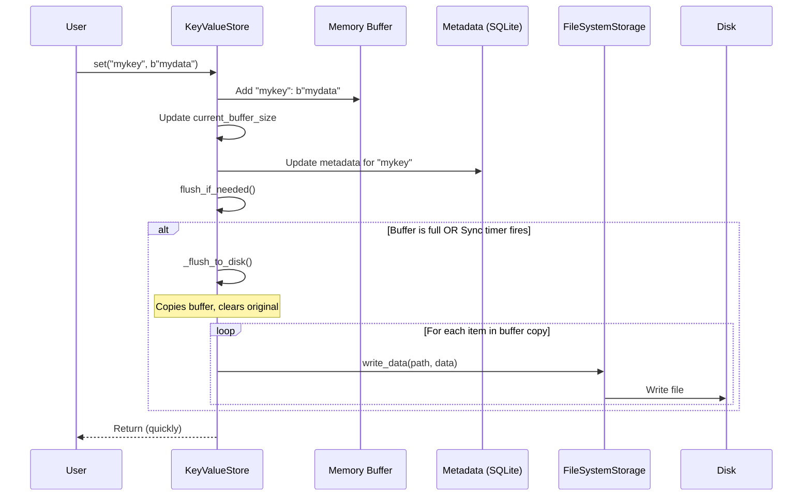

# Chapter 6: Data Buffering & Flushing

In [Chapter 5: Storage Backends (FileSystemStorage, RedisStorage)](05_storage_backends__filesystemstorage__redisstorage_.md), we explored the different places NADB can store your data, like your computer's hard drive (`FileSystemStorage`) or a speedy Redis server (`RedisStorage`). We learned that `FileSystemStorage` is great for reliability, but have you ever noticed that saving files to a disk can sometimes feel a bit slow, especially if you're doing it very often?

Imagine you're a librarian constantly running back and forth to the main shelves every single time someone returns a single book. It would be very inefficient! Wouldn't it be faster to keep a small stack of recently returned books on your desk and then take the whole stack to the shelves once it gets big enough?

NADB uses a similar strategy to improve performance, especially when using `FileSystemStorage`. This strategy is called **Data Buffering and Flushing**.

## The Problem: Slow Disk Writes

Writing data directly to a physical disk (like a hard drive or SSD) takes a measurable amount of time. If your application needs to save small pieces of data very frequently (like updating a user's last active time every few seconds), writing to the disk *every single time* can slow things down. Your application might feel sluggish because it's waiting for the disk.

## The Solution: Buffering

To speed things up, NADB's [KeyValueStore](01_keyvaluestore_.md) (when using `FileSystemStorage`) acts like that efficient librarian. Instead of immediately writing every new piece of data (`set` operation) to the disk (the "shelves"), it temporarily holds recent writes in a special area in your computer's memory. This memory area is called the **buffer** (like the librarian's desk).

Writing to memory is *much* faster than writing to disk. So, when you call `my_store.set(...)`, the operation often just adds your data to this memory buffer and returns almost instantly, making your application feel quicker.

## Flushing: Saving the Buffer

Of course, data sitting only in memory isn't permanently saved. If your application crashes or the power goes out, anything still only in the buffer would be lost!

To make the data durable (safely stored), NADB needs to eventually write the contents of the buffer to the actual storage backend (the disk). This process is called **flushing**.

Think of flushing as the librarian finally taking that stack of books from their desk and putting them onto the main shelves.

NADB automatically flushes the buffer under two main conditions:

1.  **Buffer Size Limit:** When the amount of data held in the buffer reaches a certain size limit (which you can configure).
2.  **Time Interval:** Periodically, after a certain amount of time has passed, even if the buffer isn't full. This is managed by a helper component called [KeyValueSync](07_keyvaluesync_.md).

This combination ensures that writes feel fast (buffering) but data doesn't stay unsafe in memory for too long (flushing).

*   **Note (v2.2.0):** NADB now automatically adapts based on **backend capabilities**. `FileSystemStorage` declares that it supports buffering (`supports_buffering=True, write_strategy="buffered"`), so KeyValueStore enables the buffer. `RedisStorage` declares `supports_buffering=False, write_strategy="immediate"`, so KeyValueStore writes directly to Redis. This automatic adaptation is explained in [Chapter 13: Backend Capabilities System](13_backend_capabilities_system.md).

## Configuring the Buffer

You actually saw the buffer configuration back in [Chapter 1: KeyValueStore](01_keyvaluestore_.md) when we first created our store! The `buffer_size_mb` parameter controls how large the memory buffer can get (in megabytes) before an automatic flush is triggered.

```python
# From Chapter 1 example:
from nadb import KeyValueStore, KeyValueSync
import atexit

# Create sync manager (manages timed flushes, covered in Chapter 7)
kv_sync = KeyValueSync(flush_interval_seconds=5) # Flush periodically every 5s
kv_sync.start()
atexit.register(kv_sync.sync_exit)

# Create store with a 1 MB buffer limit
my_store = KeyValueStore(
    data_folder_path="./my_nadb_data",
    db="my_app_db",
    namespace="config",
    buffer_size_mb=1, # <-- Set buffer size to 1 Megabyte
    sync=kv_sync,
    storage_backend="fs" # Buffering is most relevant for 'fs'
)

print(f"Store created with buffer size: {my_store.buffer_size_mb} MB")
# Expected Output: Store created with buffer size: 1 MB
```

Here, we told `KeyValueStore` to use a buffer that can hold up to 1MB of data before flushing automatically due to size. The `KeyValueSync` instance also ensures a flush happens roughly every 5 seconds, regardless of buffer size.

## Manual Flushing

Sometimes, you might want to ensure all buffered data is written to disk *right now*, perhaps before shutting down a critical part of your application. You can do this manually using the `flush()` method:

```python
# Add some data (might go into the buffer)
my_store.set("setting:color", b"blue")
my_store.set("setting:font", b"arial")

print(f"Data added. Current buffer size (approx bytes): {my_store.current_buffer_size}")

# Force writing any buffered data to disk
print("Manually flushing the buffer...")
my_store.flush()

print(f"Buffer flushed. Current buffer size: {my_store.current_buffer_size}")
# Expected Output (sizes may vary slightly):
# Data added. Current buffer size (approx bytes): <some small number>
# Manually flushing the buffer...
# Buffer flushed. Current buffer size: 0
```

Calling `my_store.flush()` tells NADB to immediately write everything currently in the buffer for that store instance to the disk.

## Under the Hood: Buffering and Flushing Mechanism

Let's trace how buffering works when you use `set` with the `FileSystemStorage`.

1.  **You call `my_store.set(key, value)`**.
2.  **`KeyValueStore`** receives the call.
3.  It checks if it's using the `RedisStorage`. If not (i.e., it's using `FileSystemStorage`), it proceeds with buffering.
4.  It adds the `key` and `value` to an internal dictionary called `self.buffer`.
5.  It updates a counter `self.current_buffer_size` to track how much data (in bytes) is in the buffer.
6.  It updates the associated metadata (e.g., in the SQLite database managed by [KeyValueMetadata](08_keyvaluemetadata_.md)) to record that the key exists, its size, timestamps, etc. The metadata update often happens immediately even if the data is buffered.
7.  It calls `self.flush_if_needed()`. This method checks if `self.current_buffer_size` has exceeded the `self.buffer_size_mb` limit.
8.  **If the buffer is full:** `flush_if_needed()` calls `self._flush_to_disk()`.
    *   `_flush_to_disk()` makes a copy of the current `self.buffer`.
    *   It clears the original `self.buffer` and resets `self.current_buffer_size` to 0 (so new writes can come in while flushing happens).
    *   It iterates through the *copy* of the buffer. For each `key`, `value` pair:
        *   It may compress the `value`.
        *   It asks the `FileSystemStorage` object (`self.storage`) to write the data to disk: `self.storage.write_data(path, data_to_write)`.
9.  **Periodically:** The [KeyValueSync](07_keyvaluesync_.md) process (running in the background) also calls `flush_if_needed()` on the store based on its timer (`flush_interval_seconds`), triggering a flush even if the buffer isn't full.



### Code Glimpse

Let's look at simplified code snippets from `nakv.py` that handle this.

**Initialization (`KeyValueStore.__init__`)**

```python
# Simplified from nakv.py - KeyValueStore.__init__ (v2.2.0)
class KeyValueStore:
    def __init__(self, data_folder_path: str, db: str, buffer_size_mb: float,
                 namespace: str, sync: KeyValueSync, storage_backend: str = "fs", ...):
        # ... other setup ...
        self.buffer_size_mb = buffer_size_mb
        self.buffer = {}  # The actual buffer dictionary
        self.current_buffer_size = 0 # Tracks buffer usage in bytes

        # Storage backend (e.g., FileSystemStorage)
        self.storage = StorageFactory.create_storage(...)

        # NEW in v2.2.0: Get backend capabilities
        self.capabilities = self.storage.get_capabilities()

        # Determine write strategy based on capabilities
        self.use_buffering = self.capabilities.supports_buffering and \
                            self.capabilities.write_strategy != "immediate"

        # Metadata handler (based on backend capabilities)
        if not self.capabilities.supports_metadata:
            self.metadata = KeyValueMetadata(...) # SQLite for FS
        else:
            self.metadata = None # Redis handles metadata natively

        # Register with the sync manager for timed flushes
        self.sync = sync
        sync.register_store(self)
        # ...
```

The constructor sets up the empty `buffer` dictionary, the `current_buffer_size` counter, and stores the `buffer_size_mb` limit. **In v2.2.0**, it also queries backend capabilities and sets `self.use_buffering` accordingly.

**Setting Data (`KeyValueStore.set`)**

```python
# Simplified from nakv.py - KeyValueStore.set (v2.2.0)
def set(self, key: str, value: bytes, tags: list = None):
    # ... (Input validation and locking) ...
    with self._get_lock(key):
        # NEW in v2.2.0: Unified write strategies
        if self.use_buffering:
            # Use buffered write strategy
            self._buffered_set(key, value, tags)
        else:
            # Use immediate write strategy
            self._immediate_set(key, value, tags)
    # ... (Record metrics) ...

def _buffered_set(self, key: str, value: bytes, tags: list = None):
    """Buffered write - filesystem backend."""
    # 1. Add to buffer
    self.buffer[key] = value
    self.current_buffer_size += len(value)

    # 2. Update metadata (unified interface)
    self._set_metadata({ "path": ..., "key": key, "size": ..., "tags": tags })

    # 3. Check if buffer needs flushing due to size
    self.flush_if_needed()
```

**In v2.2.0**, the `set` method uses capabilities-based write strategies instead of checking backend type. When buffering is enabled (`self.use_buffering=True` for filesystem), it calls `_buffered_set()` which adds data to the buffer and checks if flushing is needed.

**Checking Flush Condition (`KeyValueStore.flush_if_needed`)**

```python
# Simplified from nakv.py - KeyValueStore.flush_if_needed
def flush_if_needed(self):
    """Flush the buffer to disk if it's reached the size threshold."""
    if self._should_flush(): # Calls the check below
        self._flush_to_disk() # Calls the flush implementation

# Simplified from nakv.py - KeyValueStore._should_flush
def _should_flush(self) -> bool:
    """Check if the buffer should be flushed based on size."""
    max_size_bytes = self.buffer_size_mb * 1024 * 1024
    return self.current_buffer_size >= max_size_bytes
```

`flush_if_needed` simply calls `_should_flush` which compares the current buffer size against the configured limit (converted to bytes). If it exceeds the limit, `_flush_to_disk` is called.

**Flushing the Buffer (`KeyValueStore._flush_to_disk`)**

```python
# Simplified from nakv.py - KeyValueStore._flush_to_disk
def _flush_to_disk(self):
    """Write buffered data to disk (called by flush_if_needed or manual flush)."""
    if not self.buffer: # Nothing to flush
        return

    # 1. Copy buffer and clear original
    buffer_copy = dict(self.buffer)
    self.buffer.clear()
    self.current_buffer_size = 0

    # 2. Iterate through the copy
    for key, value in buffer_copy.items():
        try:
            with self._get_lock(key): # Lock specific key during write
                path = self._get_path(key)
                data_to_write = self._compress_data(value) # Optional compression

                # 3. Use storage backend to write
                success = self.storage.write_data(path, data_to_write)

                if not success:
                    # Handle error: Put back in buffer? Log?
                    logging.error(f"Failed to flush key {key}")
                    self.buffer[key] = value # Put back for retry later
                    self.current_buffer_size += len(value)
            # ... (Record metrics) ...
        except Exception as e:
            logging.error(f"Error flushing key {key}: {e}")
            # Put back in buffer on error
            self.buffer[key] = value
            self.current_buffer_size += len(value)
```

This method safely copies the buffer, clears the live buffer, and then attempts to write each item from the copy to the disk using the storage backend's `write_data` method.

## Conclusion

You've learned about data buffering and flushing in NADB – a performance optimization technique primarily used by the `FileSystemStorage` backend. By temporarily holding recent writes in a memory **buffer** (like a librarian's desk), NADB makes `set` operations feel much faster. The data is then **flushed** (written) to the persistent storage (the shelves/disk) when the buffer fills up or after a set time interval, ensuring durability. You saw how to configure the buffer size (`buffer_size_mb`) and how to manually trigger a flush using `.flush()`.

This mechanism strikes a balance between write performance and data safety. But what manages the *timed* flushing and other background tasks like cleaning up expired ([Chapter 3: TTL (Time-To-Live)](03_ttl__time_to_live__.md)) items?

Let's dive into the background worker that keeps NADB running smoothly in [Chapter 7: KeyValueSync](07_keyvaluesync_.md).

---
