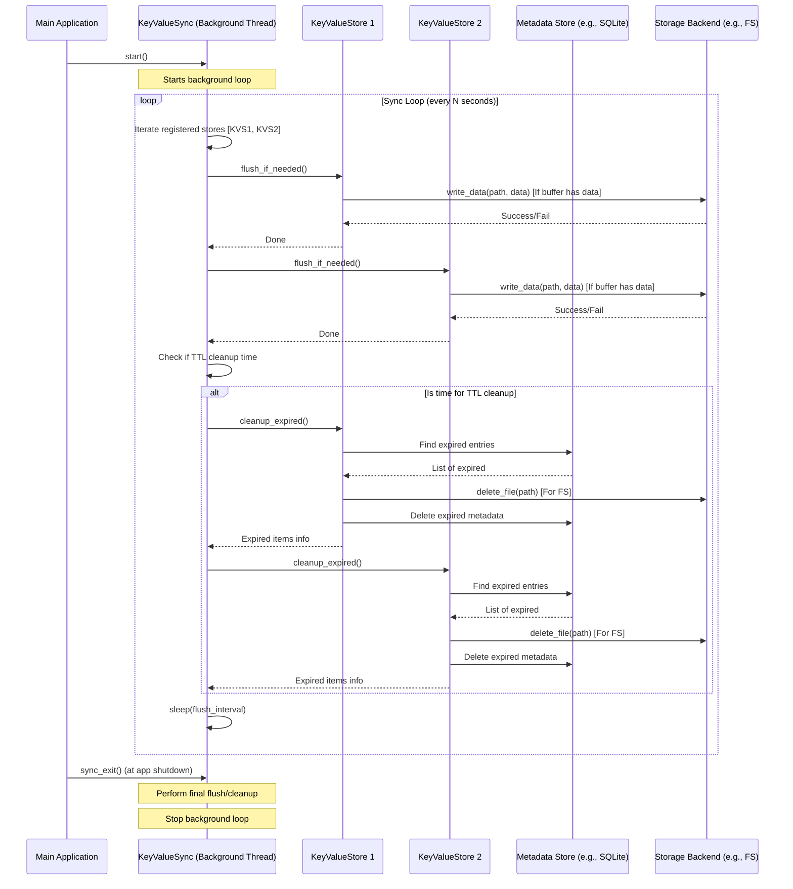

# Chapter 7: KeyValueSync - NADB's Diligent Assistant

In [Chapter 6: Data Buffering & Flushing](06_data_buffering___flushing_.md), we learned how NADB, especially when using the filesystem backend, uses an in-memory buffer to make saving data (`set`) feel faster. We also learned that this buffered data needs to be "flushed" (written) to the actual storage eventually. We saw that flushing happens when the buffer gets full, but what if the buffer *doesn't* fill up quickly? How does NADB ensure data still gets saved regularly? Also, who cleans up the old data that has expired because its [TTL (Time-To-Live)](03_ttl__time_to_live__.md) ran out?

Meet `KeyValueSync`! Think of it as a **diligent background assistant** working tirelessly behind the scenes for your `KeyValueStore`.

## What Does the Assistant Do?

The `KeyValueSync` assistant has two main responsibilities:

1.  **Regular Flushing:** Remember our librarian analogy from Chapter 6? The librarian might put books on the main shelves when their desk (buffer) is full. But what if only a few books come in? The librarian wouldn't want to leave them on the desk forever. `KeyValueSync` acts like a timer for the librarian. Every few seconds (you can configure how often), it tells *all* the `KeyValueStore` instances it manages, "Hey, it's time! Write any data you have waiting in your buffer to the permanent storage, even if the buffer isn't full." This ensures your data gets saved reliably without long delays.
2.  **Expired Data Cleanup (TTL):** Remember setting expiration times on data using [TTL (Time-To-Live)](03_ttl__time_to_live__.md)? `KeyValueSync` is also the janitor. Periodically (usually less often than flushing), it checks all the data records in the stores it manages. If it finds any data whose TTL has expired, it cleans it up by removing the data itself and its metadata record. This prevents old, temporary data from cluttering your storage.

`KeyValueSync` runs in a separate background thread, meaning it does its work without blocking your main application, keeping things running smoothly.

## How to Use KeyValueSync

Using `KeyValueSync` is straightforward. You typically only interact with it during the initial setup of your `KeyValueStore`.

1.  **Create an Instance:** You create a `KeyValueSync` object, telling it how often (in seconds) it should perform its flushing checks.
2.  **Start It:** You call the `.start()` method to get the assistant working in the background.
3.  **Give It to Your Store(s):** When you create a `KeyValueStore`, you pass the `KeyValueSync` instance to it using the `sync` parameter. The store then registers itself with the assistant.
4.  **Ensure Shutdown (Optional but Recommended):** It's good practice to tell the assistant to finish its work and stop cleanly when your application exits.

Let's look at the code we used back in [Chapter 1: KeyValueStore](01_keyvaluestore_.md), focusing on the `KeyValueSync` parts:

```python
# Import the necessary classes
from nadb import KeyValueStore, KeyValueSync
import atexit # Used to register a function to run at program exit

# 1. Create the KeyValueSync instance
#    Tell it to check for flushing every 5 seconds.
kv_sync = KeyValueSync(flush_interval_seconds=5)

# 2. Start the background assistant thread.
kv_sync.start()
print("KeyValueSync assistant started.")

# 3. Create your KeyValueStore and pass the assistant to it.
data_folder = "./my_nadb_data_ch7"
my_store = KeyValueStore(
    data_folder_path=data_folder,
    db="chapter7_db",
    namespace="examples",
    buffer_size_mb=1,
    sync=kv_sync # <-- Here we give the assistant to the store!
    # storage_backend="fs" # Buffering/timed flush is most important for 'fs'
)
print("KeyValueStore created and registered with KeyValueSync.")

# (You can create multiple stores and pass the SAME kv_sync instance to all of them)
# another_store = KeyValueStore(..., sync=kv_sync)

# 4. Register a function to stop the assistant cleanly when the program exits.
#    This ensures any final buffered data gets flushed.
atexit.register(kv_sync.sync_exit)
print("Registered KeyValueSync exit handler.")

# --- Your application code would go here ---
# my_store.set("some_key", b"some_data")
# ... the kv_sync assistant works in the background ...
# ---

# (Keep the script running briefly to see background activity, if any)
# import time
# print("Waiting a bit...")
# time.sleep(10)
# print("Done.")
```

In this code:

*   We create `kv_sync` with a 5-second interval.
*   We start its background thread with `kv_sync.start()`.
*   We pass `kv_sync` to the `KeyValueStore` constructor. Internally, the store calls `kv_sync.register_store(self)`.
*   `atexit.register(kv_sync.sync_exit)` ensures that before the program fully quits, `kv_sync` gets a chance to perform one last flush of all registered stores.

Once started, `KeyValueSync` does its job automatically. You don't usually need to call its methods again.

## Under the Hood: How the Assistant Works

`KeyValueSync` is designed to be simple but effective.

1.  **Separate Thread:** When you call `kv_sync.start()`, it creates and starts a new background thread. This thread runs the main synchronization loop (`_run` method).
2.  **The Loop:** The loop in the `_run` method does the following repeatedly:
    *   **Iterate Stores:** It goes through the list of all `KeyValueStore` instances that were registered with it.
    *   **Timed Flush:** For each store, it calls a method like `store.flush_if_needed()`. Even if the buffer isn't full based on size ([Chapter 6: Data Buffering & Flushing](06_data_buffering___flushing_.md)), this timed check ensures flushing happens regularly for filesystem backends.
    *   **TTL Check:** It checks if enough time has passed since the last TTL cleanup (e.g., maybe it only checks every 60 seconds).
    *   **TTL Cleanup:** If it's time for TTL cleanup, it calls `store.cleanup_expired()` on each store. This method handles finding and removing expired items based on the storage backend (checking metadata for filesystem, potentially triggering Redis cleanup commands).
    *   **Sleep:** After checking all stores, the thread sleeps for the specified `flush_interval_seconds`.
3.  **Exit:** When `kv_sync.sync_exit()` is called (e.g., by `atexit`), it sets a flag to stop the loop, performs one final flush and cleanup, and waits for the background thread to finish.



### Code Glimpse

Let's peek at simplified versions of the key methods in `nakv.py`.

**Initialization (`KeyValueSync.__init__`)**

```python
# Simplified from nakv.py - KeyValueSync.__init__
class KeyValueSync:
    def __init__(self, flush_interval_seconds: int):
        self.flush_interval = flush_interval_seconds
        self.stores = [] # List to hold registered KeyValueStore instances
        self.is_running = False
        self.thread = None
        self.last_ttl_cleanup = datetime.now()
        self.ttl_cleanup_interval = 60 # Check TTL every 60 seconds by default
```

The constructor mainly stores the `flush_interval` and initializes an empty list `stores` to keep track of the `KeyValueStore` objects it needs to manage.

**Starting the Assistant (`KeyValueSync.start` and `_run`)**

```python
# Simplified from nakv.py - KeyValueSync.start
def start(self):
    if self.is_running:
        return # Don't start if already running
    self.is_running = True
    # Create a background thread that will run the _run method
    self.thread = threading.Thread(target=self._run, daemon=True)
    self.thread.start()

# Simplified from nakv.py - KeyValueSync._run
def _run(self):
    while self.is_running:
        try:
            # Call the main work function
            self.flush_and_sleep()
        except Exception as e:
            logging.error(f"Error in sync thread: {e}")
            time.sleep(1) # Avoid rapid failures

# Simplified from nakv.py - KeyValueSync.flush_and_sleep
def flush_and_sleep(self):
    # --- Timed Flush ---
    for store in self.stores:
        # Tell each store to flush its buffer if needed (due to size OR time)
        store.flush_if_needed() # The store internally handles flushing logic

    # --- TTL Cleanup ---
    # Check if it's time to clean up expired items
    if (datetime.now() - self.last_ttl_cleanup).total_seconds() >= self.ttl_cleanup_interval:
        self._cleanup_expired_entries() # Call the cleanup helper
        self.last_ttl_cleanup = datetime.now() # Reset the timer

    # --- Sleep ---
    time.sleep(self.flush_interval) # Wait before the next cycle
```

`start` creates and starts the background thread. The `_run` method contains the main loop that calls `flush_and_sleep`. `flush_and_sleep` iterates through the registered stores, calls `flush_if_needed` on each, checks if it's time for TTL cleanup, calls `_cleanup_expired_entries` if needed, and then sleeps.

**Cleaning Up Expired Items (`KeyValueSync._cleanup_expired_entries`)**

```python
# Simplified from nakv.py - KeyValueSync._cleanup_expired_entries
def _cleanup_expired_entries(self):
    total_expired = 0
    # Go through each registered store
    for store in self.stores:
        try:
            # Ask the store to perform its own cleanup
            # The store knows how to talk to its metadata/storage backend
            expired_items = store.cleanup_expired()
            if expired_items:
                total_expired += len(expired_items)
        except Exception as e:
            logging.error(f"Error cleaning up store {store.name}: {e}")
    if total_expired > 0:
        logging.info(f"Removed {total_expired} expired entries")
```

This helper method simply asks each registered `KeyValueStore` to handle its own expiration cleanup by calling `store.cleanup_expired()`. The store then interacts with its specific [Metadata Store](08_keyvaluemetadata_.md) and [Storage Backend](05_storage_backends__filesystemstorage__redisstorage_.md) to find and remove the expired data.

**Store Registration (`KeyValueStore.__init__`)**

```python
# Simplified from nakv.py - KeyValueStore.__init__
class KeyValueStore:
    def __init__(self, ..., sync: KeyValueSync, ...):
        # ... other setup ...
        self.sync = sync
        # Tell the sync manager about this new store instance
        sync.register_store(self)
        # ...
```

When a `KeyValueStore` is created, it stores the passed `KeyValueSync` instance and immediately calls `sync.register_store(self)` to add itself to the assistant's list of stores to manage.

## Conclusion

`KeyValueSync` is the essential background assistant in NADB. It runs quietly in a separate thread, ensuring that buffered data (especially for the filesystem backend) is regularly flushed to disk for safety and that data past its expiration time (TTL) is automatically cleaned up. You interact with it mainly during setup by creating it, starting it, and passing it to your `KeyValueStore` instances. It's a key component for keeping NADB reliable and tidy without interrupting your main application flow.

We've mentioned several times that `KeyValueSync` interacts with stores to clean up expired data, and stores interact with metadata to find *where* data is or *when* it expires. But what exactly is this metadata, and how is it managed?

Let's delve into the details of how NADB keeps track of your data in [Chapter 8: KeyValueMetadata](08_keyvaluemetadata_.md).

---
