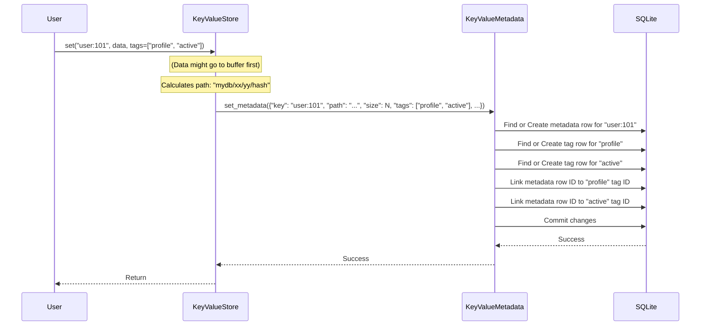
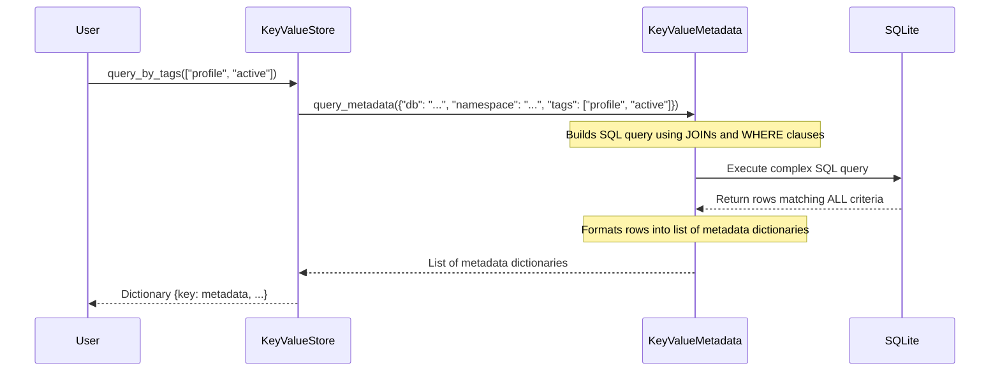
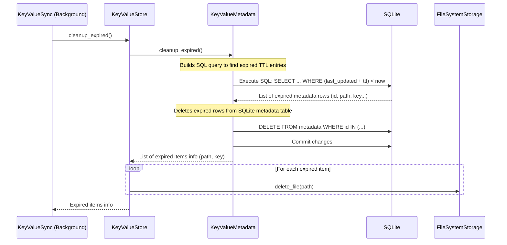

# Chapter 8: KeyValueMetadata - NADB's Index Card System

Welcome to the final chapter! In [Chapter 7: KeyValueSync](07_keyvaluesync_.md), we met the background assistant that handles regular data flushing and cleans up expired items based on their [TTL (Time-To-Live)](03_ttl__time_to_live__.md). But how does `KeyValueSync` know which items are expired? And when you ask the [KeyValueStore](01_keyvaluestore_.md) to `get()` a specific key using the filesystem backend, how does it know *which file* on your disk corresponds to that key?

Imagine you have a huge archive of physical documents stored in plain folders on shelves. Without some kind of index or catalog, finding a specific document would be nearly impossible! You'd need a system to track where each document is, what it's called, when it was added, and maybe some keywords (tags) associated with it.

NADB faces a similar challenge, especially when using the **FileSystemStorage** backend ([Chapter 5: Storage Backends (FileSystemStorage, RedisStorage)](05_storage_backends__filesystemstorage__redisstorage_.md)), which stores your data as individual files on disk. It needs a way to keep track of everything. This is where `KeyValueMetadata` comes in.

## What is KeyValueMetadata?

Think of `KeyValueMetadata` as NADB's **index card system** specifically for the `FileSystemStorage` backend. It's responsible for storing and managing information *about* your data, rather than the data itself. For every piece of data you store using the filesystem backend, `KeyValueMetadata` keeps an "index card" with details like:

*   **Key:** The original string key you used (e.g., `"user:123:profile"`).
*   **Path:** The exact location (relative path) on the disk where the data file is stored (e.g., `"my_db/a1/b2/a1b2c3d4..."`).
*   **DB & Namespace:** Which database and namespace the key belongs to.
*   **Size:** How large the original data is (in bytes).
*   **Timestamps:** When the data was created, last updated, and last accessed.
*   **TTL:** If you set an expiration time ([Chapter 3: TTL (Time-To-Live)](03_ttl__time_to_live__.md)), the duration (in seconds) is stored here.
*   **Tags:** Any [Tags](02_tags_.md) you associated with the data (e.g., `["image", "avatar"]`).

**How is it stored?** For the filesystem backend, `KeyValueMetadata` uses a simple but powerful tool: an **SQLite database**. SQLite is a lightweight database system that stores the entire database in a single file (usually named something like `yourdb_meta.db`) within your main data folder. This file acts as the organized filing cabinet for all the index cards.

**What about Redis?** When you use the `RedisStorage` backend, metadata is handled differently. Redis has its own ways of storing extra information (like using Redis Hashes) and managing expirations (native TTL). In this case, the `RedisStorage` backend itself manages metadata directly within Redis, and the `KeyValueMetadata` class we're discussing here is generally *not* used.

*   **Note (v2.2.0):** NADB now uses a **unified metadata interface** that works transparently with both backends. The `KeyValueStore` automatically detects backend capabilities and routes metadata operations appropriately - to `KeyValueMetadata` (SQLite) for filesystem backend, or to the backend itself for Redis. This abstraction is explained in [Chapter 13: Backend Capabilities System](13_backend_capabilities_system.md).

## The Role of KeyValueMetadata

You typically won't interact with `KeyValueMetadata` directly in your code. It works silently behind the scenes, coordinated by the [KeyValueStore](01_keyvaluestore_.md) and the [KeyValueSync](07_keyvaluesync_.md) assistant (when using the filesystem backend).

Here's when it gets involved:

*   **`set(key, value, tags=...)`:** When you store data, `KeyValueStore` tells `KeyValueMetadata` to create or update the index card (SQLite record) for that `key`, recording its path, size, current time, and tags.
*   **`set_with_ttl(key, value, ttl_seconds=...)`:** Similar to `set`, but also tells `KeyValueMetadata` to record the `ttl_seconds` on the index card.
*   **`get(key)`:** When you retrieve data, `KeyValueStore` first asks `KeyValueMetadata`, "Where is the file for this `key`?" `KeyValueMetadata` looks up the index card, finds the `path`, and tells the `KeyValueStore`. It also updates the `last_accessed` time on the card.
*   **`delete(key)`:** `KeyValueStore` tells `KeyValueMetadata` to remove the index card for the given `key`.
*   **`query_by_tags(tags=...)`:** `KeyValueStore` asks `KeyValueMetadata`, "Find all index cards that have *all* of these `tags`." `KeyValueMetadata` performs the search in its SQLite database and returns the matching cards.
*   **`KeyValueSync` Cleanup:** The background assistant periodically asks `KeyValueMetadata`, "Find all index cards whose `ttl` has expired based on their `last_updated` time." `KeyValueMetadata` queries the SQLite database and returns the list of expired cards so the corresponding data files and metadata records can be deleted.

## Under the Hood: The SQLite Index

Let's peek inside the filing cabinet (the SQLite database) used by `KeyValueMetadata` for the filesystem backend. It typically has three main tables:

1.  **`metadata` Table:** This is the main collection of index cards. Each row represents one key-value pair you've stored.
    *   Columns: `id` (unique number), `path` (file location), `key`, `db`, `namespace`, `created_at`, `last_updated`, `last_accessed`, `size`, `ttl`.
2.  **`tags` Table:** This table simply lists all the unique tag names that have ever been used.
    *   Columns: `id` (unique number), `tag_name` (e.g., "image", "urgent").
3.  **`metadata_tags` Table:** This is a "linking" table. It connects the `metadata` cards to the `tags`. If a key has three tags, there will be three rows in this table linking the `metadata.id` to the corresponding `tags.id` for each tag.
    *   Columns: `metadata_id`, `tag_id`.

This structure allows efficient lookups and queries.

### Example: Storing Data (`set`)

When you call `my_store.set("user:101", b"userdata", tags=["profile", "active"])` using the filesystem backend:



1.  The `KeyValueStore` prepares a dictionary containing all the metadata details (key, path, size, tags, etc.).
2.  It calls `KeyValueMetadata.set_metadata()` with this dictionary.
3.  `KeyValueMetadata` interacts with the SQLite database:
    *   It finds or inserts a row in the `metadata` table.
    *   It finds or inserts rows for "profile" and "active" in the `tags` table.
    *   It inserts rows in the `metadata_tags` table to link the metadata record to the two tags.

**Code Glimpse (`nakv.py` - `KeyValueMetadata.set_metadata`)**

```python
# Simplified from nakv.py - KeyValueMetadata.set_metadata
def set_metadata(self, metadata: dict):
    # ... (Get SQLite connection, acquire lock) ...
    db = self._get_db_connection()
    with self.connection_lock:
        # Check if record exists for this key/db/namespace
        cur = db.execute("SELECT id FROM metadata WHERE key = ? AND ...", (metadata["key"], ...))
        row = cur.fetchone()

        if row: # Existing record - UPDATE it
            metadata_id = row[0]
            sql = "UPDATE metadata SET last_updated=?, size=?, ttl=? WHERE id=?"
            params = (datetime.now(), metadata["size"], metadata.get("ttl"), metadata_id)
            db.execute(sql, params)
        else: # New record - INSERT it
            sql = "INSERT INTO metadata (path, key, ..., size, ttl) VALUES (?, ?, ..., ?, ?)"
            params = (metadata["path"], metadata["key"], ..., metadata["size"], metadata.get("ttl"))
            cursor = db.execute(sql, params)
            metadata_id = cursor.lastrowid # Get the ID of the new row

        # Handle tags (calls self.set_tags)
        if "tags" in metadata and metadata["tags"]:
            self.set_tags(metadata_id, metadata["tags"])

        db.commit() # Save changes
    # ... (Error handling) ...
```

This method handles both creating new metadata records and updating existing ones. It then calls `set_tags` (another method in `KeyValueMetadata`) to manage the links in the `metadata_tags` table.

### Example: Querying by Tags (`query_by_tags`)

When you call `my_store.query_by_tags(["profile", "active"])`:



1.  `KeyValueStore` calls `KeyValueMetadata.query_metadata()` with the tags and other context.
2.  `KeyValueMetadata` constructs a complex SQL query. This query joins the `metadata`, `metadata_tags`, and `tags` tables. It includes conditions to ensure that the returned `metadata` rows are linked to *both* the tag "profile" AND the tag "active".
3.  SQLite executes the query and returns the matching rows.
4.  `KeyValueMetadata` formats these rows into a list of dictionaries, each representing a complete index card.

**Code Glimpse (`nakv.py` - `KeyValueMetadata.query_metadata` - Tag Handling Part)**

```python
# Simplified from nakv.py - KeyValueMetadata.query_metadata
def query_metadata(self, query: dict) -> list:
    conditions = []
    params = []
    # ... (Handle other query fields like db, namespace) ...

    # === Tag Filters ===
    if 'tags' in query and query['tags']:
        tag_conditions = []
        for tag in query['tags']:
            # This subquery finds metadata IDs linked to a specific tag name
            tag_subquery = """
                m.id IN (
                    SELECT metadata_id
                    FROM metadata_tags mt JOIN tags t ON mt.tag_id = t.id
                    WHERE t.tag_name = ?
                )
            """
            tag_conditions.append(tag_subquery)
            params.append(tag) # Add the tag name to the query parameters

        # Combine tag conditions with AND
        conditions.append(f"({' AND '.join(tag_conditions)})")
    # ====================

    # Build the main SQL query
    sql = "SELECT m.*, GROUP_CONCAT(t.tag_name) as tags FROM metadata m ..."
    if conditions:
        sql += f" WHERE {' AND '.join(conditions)}"
    sql += " GROUP BY m.id"

    # ... (Execute query with params, fetch rows, format results) ...
    # return list_of_metadata_dictionaries
```

This snippet shows how, for each tag in the query, a condition is added to the SQL `WHERE` clause ensuring the metadata entry is linked to that tag. The conditions are joined by `AND`, meaning an entry must match *all* specified tags to be included in the results.

### Example: Cleaning Expired Items (`KeyValueSync` -> `cleanup_expired`)

Periodically, the `KeyValueSync` assistant triggers the cleanup process:



1.  `KeyValueSync` calls `store.cleanup_expired()`.
2.  The `KeyValueStore` (for filesystem backend) calls `KeyValueMetadata.cleanup_expired()`.
3.  `KeyValueMetadata` executes an SQL query to find all rows in the `metadata` table where `ttl` is set and `last_updated + ttl seconds` is earlier than the current time.
4.  It deletes these expired rows from the `metadata` table in SQLite.
5.  It returns a list of the expired items' details (like their `path` and `key`) to the `KeyValueStore`.
6.  The `KeyValueStore` then iterates through this list and tells the `FileSystemStorage` to delete the actual data file corresponding to each `path`.

**Code Glimpse (`nakv.py` - `KeyValueMetadata.cleanup_expired`)**

```python
# Simplified from nakv.py - KeyValueMetadata.cleanup_expired
def cleanup_expired(self):
    now = datetime.now()
    # SQL to find entries where (last_updated + ttl seconds) is before now
    sql = """
        SELECT id, path, key, db, namespace
        FROM metadata
        WHERE ttl IS NOT NULL AND last_updated IS NOT NULL
          AND datetime(last_updated, '+' || ttl || ' seconds') < ?
    """
    db_conn = self._get_db_connection()
    expired_items_info = []
    with self.connection_lock:
        cursor = db_conn.execute(sql, (now,))
        expired_entries = cursor.fetchall()
        if expired_entries:
            expired_ids = []
            for entry in expired_entries:
                # Collect info to return
                expired_items_info.append({"id": entry[0], "path": entry[1], "key": entry[2], ...})
                expired_ids.append(entry[0])

            # Delete the metadata rows from SQLite in bulk
            if expired_ids:
                 placeholder = ','.join('?' for _ in expired_ids)
                 db_conn.execute(f"DELETE FROM metadata WHERE id IN ({placeholder})", expired_ids)

            db_conn.commit() # Save changes
    return expired_items_info # Return list of what was deleted
```

This method efficiently finds expired entries using SQLite's date/time functions and deletes them from the metadata database.

## Conclusion

`KeyValueMetadata` is the unsung hero for NADB's filesystem backend. It acts as the crucial index card system, implemented using an SQLite database, that keeps track of where your data files are, their original keys, sizes, timestamps, tags, and TTL information. While you don't interact with it directly, it's constantly working behind the scenes with the [KeyValueStore](01_keyvaluestore_.md) and [KeyValueSync](07_keyvaluesync_.md) to enable efficient data retrieval, tag-based querying, and automatic expiration cleanup. Understanding its role helps complete the picture of how NADB manages your data effectively on disk.

This marks the end of our introductory tutorial series on NADB! We've journeyed from the basic `KeyValueStore` interface through tags, TTL, storage choices, buffering, background synchronization, and finally, the metadata management system. You should now have a solid foundation for using NADB in your projects. Happy coding!

---
