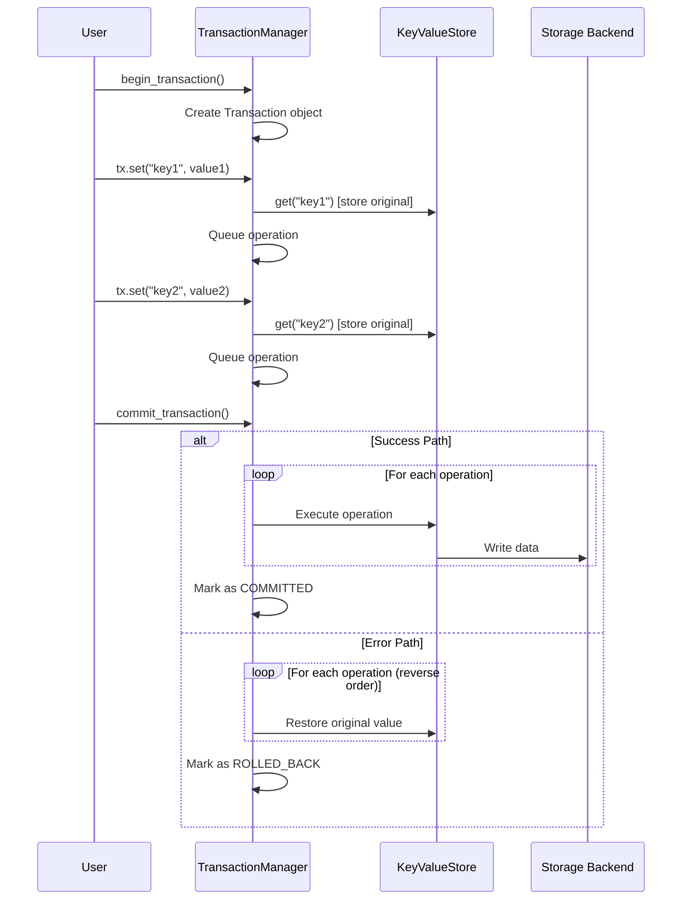

# Chapter 9: Advanced Features - Transactions

In previous chapters, we learned about the core functionality of NADB. Now let's explore one of the advanced features: **Transactions**. Transactions allow you to group multiple operations together and ensure they either all succeed or all fail, maintaining data consistency.

## What are Transactions?

A transaction is a sequence of operations that are executed as a single unit of work. Think of it like a bank transfer - you want to debit one account and credit another, but if either operation fails, you want both to be undone to maintain consistency.

In NADB, transactions provide:
- **Atomicity**: All operations in a transaction succeed or all fail
- **Consistency**: Data remains in a valid state
- **Isolation**: Transactions don't interfere with each other
- **Rollback**: Automatic undo of operations when errors occur

## Using Transactions

### Context Manager Approach (Recommended)

The easiest way to use transactions is with the context manager:

```python
from nadb import KeyValueStore, KeyValueSync

# Setup (same as before)
kv_sync = KeyValueSync(flush_interval_seconds=5)
kv_sync.start()

# Create store with transactions enabled
kv_store = KeyValueStore(
    data_folder_path="./data",
    db="my_db",
    buffer_size_mb=1,
    namespace="transactions_demo",
    sync=kv_sync,
    enable_transactions=True  # Enable transactions
)

# Use transactions with context manager
with kv_store.transaction() as tx:
    tx.set("user:1", b"Alice", ["user", "active"])
    tx.set("user:2", b"Bob", ["user", "inactive"])
    tx.set("config:theme", b"dark", ["config"])
    # All operations are committed automatically when exiting the context

print("Transaction completed successfully!")
```

If any operation within the transaction fails, all operations are automatically rolled back:

```python
try:
    with kv_store.transaction() as tx:
        tx.set("user:3", b"Charlie", ["user", "active"])
        tx.set("user:4", b"David", ["user", "active"])
        # Simulate an error
        raise ValueError("Something went wrong!")
except ValueError:
    print("Transaction was rolled back due to error")

# Verify that no data was actually stored
try:
    kv_store.get("user:3")  # This will raise KeyError
except KeyError:
    print("Rollback successful - no data was stored")
```

### Manual Transaction Management

For more control, you can manage transactions manually:

```python
# Begin a transaction
transaction = kv_store.begin_transaction()

try:
    # Create a transaction context
    from transaction import TransactionContext
    tx_context = TransactionContext(kv_store.transaction_manager, transaction)
    
    # Add operations
    tx_context.set("key1", b"value1", ["tag1"])
    tx_context.set("key2", b"value2", ["tag2"])
    
    # Commit the transaction
    kv_store.commit_transaction(transaction)
    print("Transaction committed successfully")
    
except Exception as e:
    # Rollback on error
    kv_store.rollback_transaction(transaction)
    print(f"Transaction rolled back: {e}")
```

### Batch Operations

Transactions are perfect for batch operations:

```python
# Batch set operations
user_data = [
    ("user:100", b"Alice Johnson", ["user", "premium"]),
    ("user:101", b"Bob Smith", ["user", "standard"]),
    ("user:102", b"Carol Davis", ["user", "premium"])
]

with kv_store.transaction() as tx:
    tx.batch_set(user_data)

print(f"Batch inserted {len(user_data)} users")

# Batch delete operations
keys_to_delete = ["user:100", "user:101", "user:102"]

with kv_store.transaction() as tx:
    tx.batch_delete(keys_to_delete)

print(f"Batch deleted {len(keys_to_delete)} users")
```

## Transaction Isolation Levels

NADB supports different isolation levels:

```python
# Default isolation level
with kv_store.transaction() as tx:
    tx.set("key1", b"value1")

# Specify isolation level
with kv_store.transaction("READ_COMMITTED") as tx:
    tx.set("key2", b"value2")
```

Currently supported isolation levels:
- `READ_COMMITTED` (default): Prevents dirty reads

## Monitoring Transactions

You can monitor active transactions:

```python
# Get statistics including active transactions
stats = kv_store.get_stats()
print(f"Active transactions: {stats.get('active_transactions', 0)}")

# Get detailed transaction information
if kv_store.transaction_manager:
    active_txs = kv_store.transaction_manager.get_active_transactions()
    for tx in active_txs:
        print(f"Transaction {tx.transaction_id}: {len(tx.operations)} operations")
```

## Under the Hood: How Transactions Work

When you use transactions, NADB:

1. **Stores Original Values**: Before modifying any data, NADB stores the original values for rollback purposes
2. **Queues Operations**: Operations are queued but not immediately applied to the main store
3. **Atomic Commit**: On successful completion, all operations are applied atomically
4. **Automatic Rollback**: If any operation fails, all changes are undone using the stored original values



## Best Practices

### 1. Keep Transactions Short
```python
# Good: Short transaction
with kv_store.transaction() as tx:
    tx.set("user:1", b"Alice")
    tx.set("user:2", b"Bob")

# Avoid: Long-running transactions
# with kv_store.transaction() as tx:
#     for i in range(10000):  # Too many operations
#         tx.set(f"key:{i}", f"value:{i}".encode())
```

### 2. Handle Errors Gracefully
```python
def safe_user_update(kv_store, user_id, user_data, profile_data):
    try:
        with kv_store.transaction() as tx:
            tx.set(f"user:{user_id}", user_data, ["user"])
            tx.set(f"profile:{user_id}", profile_data, ["profile"])
        return True
    except Exception as e:
        logging.error(f"Failed to update user {user_id}: {e}")
        return False
```

### 3. Use Batch Operations for Multiple Items
```python
# Efficient batch operation
items = [(f"item:{i}", f"data:{i}".encode()) for i in range(100)]

with kv_store.transaction() as tx:
    tx.batch_set(items)
```

## Performance Considerations

- **Memory Usage**: Transactions store original values in memory for rollback
- **Lock Duration**: Transactions hold locks on keys during execution
- **Batch Size**: Large transactions may impact performance
- **Backend Differences**: Redis transactions behave differently than filesystem transactions

## Limitations

- **Cross-Store Transactions**: Transactions work within a single KeyValueStore instance
- **Nested Transactions**: Currently not supported
- **Read Operations**: Transaction context doesn't provide read operations (use the main store)

## Conclusion

Transactions provide a powerful way to ensure data consistency in NADB. They're particularly useful for:
- Multi-step operations that must succeed or fail together
- Batch updates that need to be atomic
- Critical operations where data integrity is paramount

The context manager approach makes transactions easy to use while providing automatic cleanup and error handling.

Ready to learn about backup and recovery? Let's move on to [Chapter 10: Advanced Features - Backup & Recovery](10_backup_recovery_.md).

---