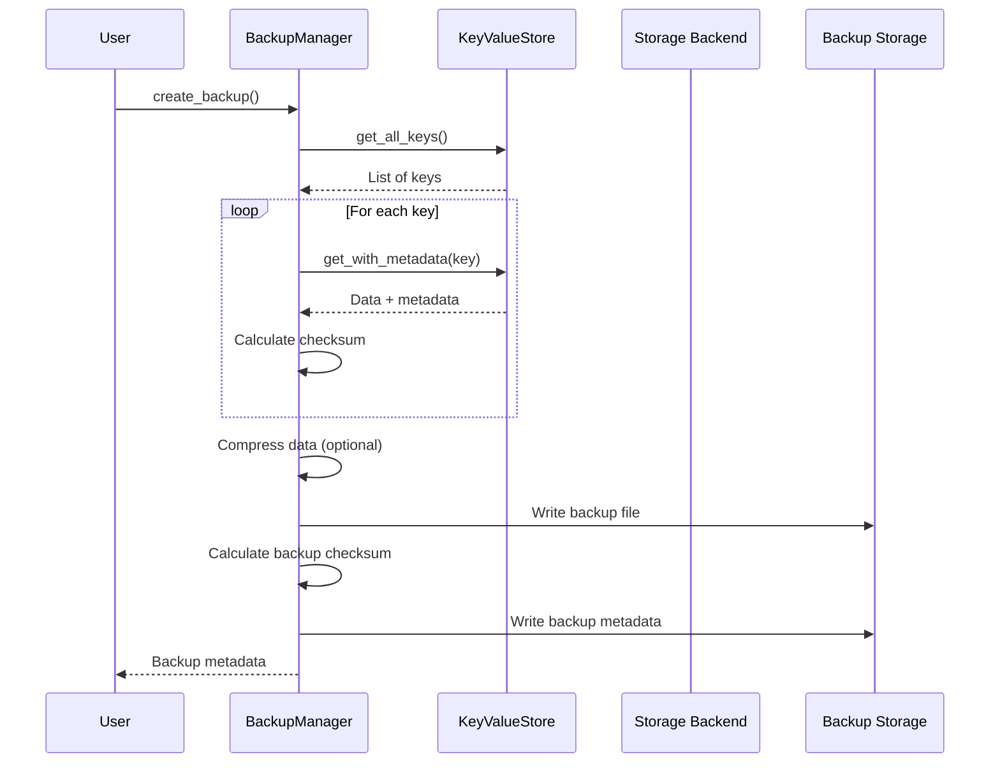

# Chapter 10: Advanced Features - Backup & Recovery

Data protection is crucial for any storage system. NADB provides comprehensive backup and recovery capabilities, including full backups, incremental backups, integrity verification, and point-in-time recovery.

## What is Backup & Recovery?

**Backup** is the process of creating copies of your data that can be used to restore the original data in case of data loss, corruption, or other disasters.

**Recovery** is the process of restoring data from backups when needed.

NADB's backup system provides:
- **Full Backups**: Complete copy of all data
- **Incremental Backups**: Only changes since the last backup
- **Compression**: Optional compression to save space
- **Integrity Verification**: Checksums to ensure backup validity
- **Metadata Preservation**: All tags and metadata are preserved

## Setting Up Backup

First, create a KeyValueStore with backup enabled:

```python
from nadb import KeyValueStore, KeyValueSync

# Setup
kv_sync = KeyValueSync(flush_interval_seconds=5)
kv_sync.start()

# Create store with backup enabled
kv_store = KeyValueStore(
    data_folder_path="./data",
    db="my_db",
    buffer_size_mb=1,
    namespace="backup_demo",
    sync=kv_sync,
    enable_backup=True  # Enable backup functionality
)

# Add some test data
kv_store.set("user:1", b"Alice", ["user", "active"])
kv_store.set("user:2", b"Bob", ["user", "inactive"])
kv_store.set("config:theme", b"dark", ["config"])
```

## Creating Backups

### Full Backup

A full backup creates a complete copy of all data:

```python
# Create a full backup
backup_metadata = kv_store.create_backup(
    backup_id="my_first_backup",  # Optional: auto-generated if not provided
    compression=True              # Optional: compress backup data
)

print(f"Backup created: {backup_metadata.backup_id}")
print(f"Files backed up: {backup_metadata.file_count}")
print(f"Total size: {backup_metadata.total_size} bytes")
print(f"Backup type: {backup_metadata.backup_type}")
print(f"Timestamp: {backup_metadata.timestamp}")
```

### Incremental Backup

Incremental backups only store changes since a previous backup:

```python
# Add more data after the full backup
kv_store.set("user:3", b"Charlie", ["user", "active"])
kv_store.set("user:4", b"David", ["user", "premium"])

# Create an incremental backup
incremental_backup = kv_store.create_incremental_backup(
    parent_backup_id="my_first_backup",  # Base backup
    backup_id="incremental_001",         # Optional
    compression=True
)

print(f"Incremental backup created: {incremental_backup.backup_id}")
print(f"Parent backup: {incremental_backup.parent_backup_id}")
print(f"New/changed files: {incremental_backup.file_count}")
```

## Managing Backups

### List All Backups

```python
# Get list of all backups
backups = kv_store.list_backups()

print(f"Total backups: {len(backups)}")
for backup in backups:
    print(f"  {backup.backup_id} ({backup.backup_type}) - {backup.timestamp}")
    print(f"    Files: {backup.file_count}, Size: {backup.total_size} bytes")
    if backup.parent_backup_id:
        print(f"    Parent: {backup.parent_backup_id}")
```

### Verify Backup Integrity

```python
# Verify a backup's integrity
backup_id = "my_first_backup"
is_valid = kv_store.verify_backup(backup_id)

if is_valid:
    print(f"Backup {backup_id} is valid ✓")
else:
    print(f"Backup {backup_id} is corrupted ✗")
```

## Restoring from Backup

### Basic Restore

```python
# Restore from a backup (this will add to existing data)
success = kv_store.restore_backup(
    backup_id="my_first_backup",
    verify_integrity=True,  # Verify backup before restoring
    clear_existing=False    # Don't clear existing data
)

if success:
    print("Restore completed successfully!")
else:
    print("Restore failed!")
```

### Complete Restore (Replace All Data)

```python
# Completely replace all data with backup
success = kv_store.restore_backup(
    backup_id="my_first_backup",
    verify_integrity=True,
    clear_existing=True  # Clear all existing data first
)

if success:
    print("Complete restore successful!")
```

### Restore from Incremental Backup

When restoring from an incremental backup, NADB automatically restores the entire backup chain:

```python
# This will restore both the full backup and incremental changes
success = kv_store.restore_backup(
    backup_id="incremental_001",  # NADB will restore the full chain
    verify_integrity=True,
    clear_existing=True
)
```

## Backup Automation

### Scheduled Backups

You can integrate backup creation with your application's scheduling:

```python
import schedule
import time
from datetime import datetime

def create_daily_backup():
    """Create a daily backup with timestamp."""
    timestamp = datetime.now().strftime("%Y%m%d_%H%M%S")
    backup_id = f"daily_backup_{timestamp}"
    
    try:
        backup_meta = kv_store.create_backup(backup_id, compression=True)
        print(f"Daily backup created: {backup_meta.backup_id}")
        
        # Clean up old backups (keep last 7 days)
        cleanup_count = kv_store.backup_manager.cleanup_old_backups(
            keep_days=7, 
            keep_count=7
        )
        if cleanup_count > 0:
            print(f"Cleaned up {cleanup_count} old backups")
            
    except Exception as e:
        print(f"Backup failed: {e}")

# Schedule daily backups at 2 AM
schedule.every().day.at("02:00").do(create_daily_backup)

# In your main application loop:
# while True:
#     schedule.run_pending()
#     time.sleep(60)
```

### Incremental Backup Strategy

```python
def create_incremental_backup_chain():
    """Create a backup strategy with weekly full and daily incremental."""
    today = datetime.now()
    
    if today.weekday() == 0:  # Monday - create full backup
        backup_id = f"full_{today.strftime('%Y%m%d')}"
        backup_meta = kv_store.create_backup(backup_id, compression=True)
        print(f"Weekly full backup: {backup_meta.backup_id}")
        return backup_id
    else:
        # Find the most recent full backup
        backups = kv_store.list_backups()
        full_backups = [b for b in backups if b.backup_type == 'full']
        
        if full_backups:
            # Sort by timestamp and get the most recent
            latest_full = sorted(full_backups, key=lambda x: x.timestamp)[-1]
            
            backup_id = f"inc_{today.strftime('%Y%m%d')}"
            backup_meta = kv_store.create_incremental_backup(
                latest_full.backup_id, backup_id, compression=True
            )
            print(f"Daily incremental backup: {backup_meta.backup_id}")
            return backup_id
        else:
            # No full backup exists, create one
            return create_full_backup()
```

## Backup Storage and Format

### Backup Directory Structure

```
./backups/
├── metadata.json                 # Backup metadata index
├── my_first_backup/              # Full backup directory
│   ├── data.json.gz             # Compressed backup data
│   └── metadata.json            # Backup-specific metadata
└── incremental_001/             # Incremental backup directory
    ├── data.json.gz             # Only changed data
    └── metadata.json            # Incremental metadata
```

### Backup Data Format

Each backup contains:

```json
{
  "backup_id": "my_first_backup",
  "timestamp": "2024-01-15T10:30:00",
  "backup_type": "full",
  "source_db": "my_db",
  "source_namespace": "backup_demo",
  "file_count": 3,
  "total_size": 1024,
  "checksum": "sha256:abc123...",
  "compression": true,
  "parent_backup_id": null
}
```

## Advanced Backup Features

### Cross-Backend Synchronization

```python
# Create stores with different backends
fs_store = KeyValueStore(
    data_folder_path="./fs_data",
    db="sync_test", namespace="fs", sync=kv_sync,
    storage_backend="fs", enable_backup=True
)

redis_store = KeyValueStore(
    data_folder_path="./redis_data",
    db="sync_test", namespace="redis", sync=kv_sync,
    storage_backend="redis", enable_backup=True
)

# Backup from filesystem
fs_backup = fs_store.create_backup("fs_backup")

# Restore to Redis (cross-backend sync)
redis_store.restore_backup("fs_backup", clear_existing=True)
```

### Backup Verification and Repair

```python
def verify_all_backups():
    """Verify integrity of all backups."""
    backups = kv_store.list_backups()
    
    for backup in backups:
        is_valid = kv_store.verify_backup(backup.backup_id)
        status = "✓ VALID" if is_valid else "✗ CORRUPTED"
        print(f"{backup.backup_id}: {status}")
        
        if not is_valid:
            print(f"  Warning: Backup {backup.backup_id} is corrupted!")
            # You might want to recreate this backup or alert administrators
```

## Under the Hood: How Backup Works



## Best Practices

### 1. Regular Backup Schedule
```python
# Implement a 3-2-1 backup strategy:
# - 3 copies of important data
# - 2 different storage media
# - 1 offsite backup

def backup_strategy():
    # Local full backup weekly
    if datetime.now().weekday() == 0:
        kv_store.create_backup(compression=True)
    
    # Daily incremental backups
    else:
        latest_full = get_latest_full_backup()
        if latest_full:
            kv_store.create_incremental_backup(latest_full.backup_id)
```

### 2. Test Your Backups
```python
def test_backup_restore():
    """Regularly test backup restoration."""
    # Create test store
    test_store = KeyValueStore(
        data_folder_path="./test_restore",
        db="test", namespace="restore_test", sync=kv_sync,
        enable_backup=True
    )
    
    try:
        # Restore latest backup to test store
        backups = kv_store.list_backups()
        if backups:
            latest = sorted(backups, key=lambda x: x.timestamp)[-1]
            success = test_store.restore_backup(latest.backup_id)
            
            if success:
                print("✓ Backup restore test passed")
            else:
                print("✗ Backup restore test failed")
    finally:
        test_store.close()
```

### 3. Monitor Backup Health
```python
def backup_health_check():
    """Check backup system health."""
    backups = kv_store.list_backups()
    
    # Check if we have recent backups
    if not backups:
        print("⚠️  No backups found!")
        return False
    
    latest = sorted(backups, key=lambda x: x.timestamp)[-1]
    latest_time = datetime.fromisoformat(latest.timestamp)
    hours_since_backup = (datetime.now() - latest_time).total_seconds() / 3600
    
    if hours_since_backup > 24:
        print(f"⚠️  Latest backup is {hours_since_backup:.1f} hours old")
        return False
    
    # Verify latest backup
    if not kv_store.verify_backup(latest.backup_id):
        print("⚠️  Latest backup is corrupted!")
        return False
    
    print("✓ Backup system healthy")
    return True
```

## Conclusion

NADB's backup and recovery system provides enterprise-grade data protection with:
- Multiple backup types (full and incremental)
- Automatic integrity verification
- Compression support
- Cross-backend compatibility
- Easy automation and monitoring

Regular backups are essential for data protection. Combine them with the other advanced features like transactions for a robust data management solution.

Ready to learn about indexing and caching? Let's move on to [Chapter 11: Advanced Features - Indexing & Caching](11_indexing_caching_.md).

---