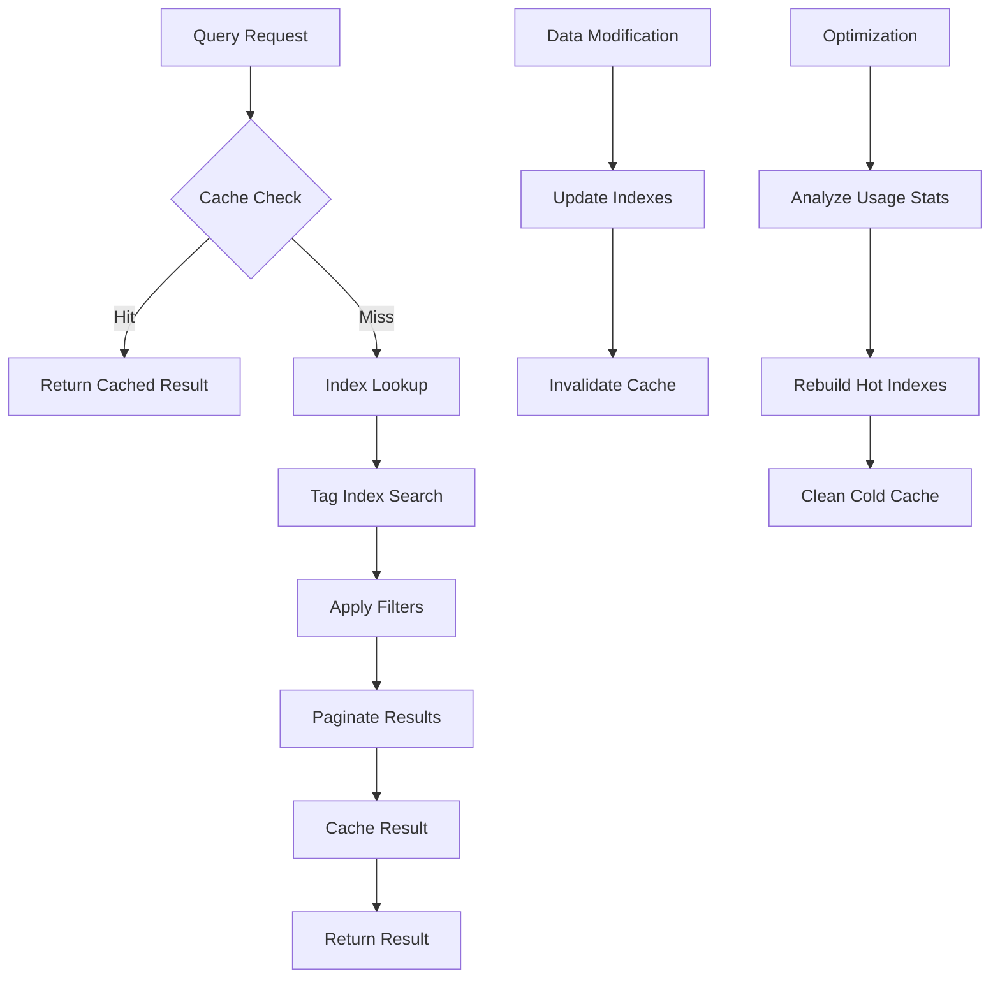

# Chapter 11: Advanced Features - Indexing & Caching

As your NADB store grows, query performance becomes increasingly important. NADB's advanced indexing and caching system provides lightning-fast queries, intelligent caching, and powerful search capabilities that scale with your data.

## What is Indexing & Caching?

**Indexing** creates optimized data structures that allow fast lookups without scanning all data. Think of it like an index in a book - instead of reading every page to find a topic, you can jump directly to the relevant pages.

**Caching** stores frequently accessed data in memory for instant retrieval, dramatically reducing query times for popular searches.

NADB's indexing system provides:
- **Tag Indexes**: Fast tag-based queries
- **LRU Caching**: Intelligent cache management
- **Query Optimization**: Automatic query planning
- **Usage Statistics**: Performance monitoring and optimization
- **Complex Queries**: Advanced search operators

## Setting Up Indexing

Create a KeyValueStore with indexing enabled:

```python
from nadb import KeyValueStore, KeyValueSync

# Setup
kv_sync = KeyValueSync(flush_interval_seconds=5)
kv_sync.start()

# Create store with indexing enabled
kv_store = KeyValueStore(
    data_folder_path="./data",
    db="my_db",
    buffer_size_mb=1,
    namespace="indexing_demo",
    sync=kv_sync,
    enable_indexing=True,  # Enable indexing and caching
    cache_size=10000       # Cache up to 10,000 query results
)

# Add test data with various tags
products = [
    ("product:1", b"Gaming Laptop", ["electronics", "computer", "gaming", "expensive"]),
    ("product:2", b"Wireless Mouse", ["electronics", "computer", "accessories", "cheap"]),
    ("product:3", b"Programming Book", ["books", "education", "programming", "cheap"]),
    ("product:4", b"Smartphone", ["electronics", "mobile", "communication", "expensive"]),
    ("product:5", b"Tablet", ["electronics", "mobile", "entertainment", "expensive"]),
    ("product:6", b"Keyboard", ["electronics", "computer", "accessories", "moderate"]),
    ("product:7", b"Monitor", ["electronics", "computer", "display", "expensive"]),
    ("product:8", b"Headphones", ["electronics", "audio", "accessories", "moderate"])
]

for key, value, tags in products:
    kv_store.set(key, value, tags)

print(f"Added {len(products)} products with tags")
```

## Basic Tag Queries with Indexing

### Simple Tag Queries

```python
# Query with AND operator (default)
electronics = kv_store.query_by_tags(["electronics"])
print(f"Electronics products: {len(electronics)}")

# Query with multiple tags (AND)
expensive_electronics = kv_store.query_by_tags(["electronics", "expensive"])
print(f"Expensive electronics: {len(expensive_electronics)}")

# The results include full metadata
for key, metadata in expensive_electronics.items():
    print(f"  {key}: tags={metadata['tags']}")
```

## Advanced Queries with Pagination

### Paginated Queries

```python
# Advanced query with pagination
result = kv_store.query_by_tags_advanced(
    tags=["electronics"],
    operator="AND",
    page=1,
    page_size=3
)

print(f"Page 1 of electronics (showing {len(result['keys'])} of {result['total_count']}):")
for key in result['keys']:
    print(f"  {key}")

print(f"Has more pages: {result['has_more']}")

# Get next page
if result['has_more']:
    page2 = kv_store.query_by_tags_advanced(
        tags=["electronics"],
        operator="AND",
        page=2,
        page_size=3
    )
    print(f"Page 2: {page2['keys']}")
```

### OR Queries

```python
# Query with OR operator
result = kv_store.query_by_tags_advanced(
    tags=["books", "audio"],
    operator="OR",
    page=1,
    page_size=10
)

print(f"Books OR audio products: {len(result['keys'])}")
for key in result['keys']:
    print(f"  {key}")
```

## Complex Queries

For even more powerful searches, use complex queries:

```python
# Complex query with multiple conditions
conditions = [
    {
        "field": "tags",
        "operator": "or",
        "values": ["electronics", "books"]  # Electronics OR books
    },
    {
        "field": "tags", 
        "operator": "and",
        "value": ["cheap"]  # AND cheap
    }
]

result = kv_store.complex_query(conditions, page=1, page_size=5)
print(f"Complex query results: {len(result['keys'])}")
print(f"Execution time: {result['execution_time_ms']:.2f}ms")
print(f"Cache hit: {result['cache_hit']}")
```

## Cache Performance

### Observing Cache Behavior

```python
# First query - cache miss
result1 = kv_store.query_by_tags_advanced(["electronics", "expensive"])
print(f"First query - Cache hit: {result1.get('cache_hit', False)}")
print(f"Execution time: {result1.get('execution_time_ms', 0):.2f}ms")

# Second identical query - cache hit
result2 = kv_store.query_by_tags_advanced(["electronics", "expensive"])
print(f"Second query - Cache hit: {result2.get('cache_hit', False)}")
print(f"Execution time: {result2.get('execution_time_ms', 0):.2f}ms")
```

### Cache Statistics

```python
# Get detailed cache statistics
stats = kv_store.get_stats()

if 'cache_stats' in stats:
    cache_stats = stats['cache_stats']
    
    print("Cache Performance:")
    for cache_name, cache_info in cache_stats.items():
        print(f"  {cache_name}:")
        print(f"    Size: {cache_info['size']}/{cache_info['max_size']}")
        print(f"    Hit rate: {cache_info['hit_rate']:.2%}")
        print(f"    Hits: {cache_info['hits']}, Misses: {cache_info['misses']}")
```

## Index Management

### Index Statistics

```python
# Get index performance statistics
stats = kv_store.get_stats()

if 'index_stats' in stats:
    index_stats = stats['index_stats']
    
    print("Index Statistics:")
    for index_name, index_info in index_stats.items():
        print(f"  {index_name}:")
        print(f"    Unique values: {index_info.unique_values}")
        print(f"    Total entries: {index_info.total_entries}")
        print(f"    Memory usage: {index_info.memory_usage_bytes} bytes")
        print(f"    Average query time: {index_info.avg_query_time_ms:.2f}ms")
```

### Query Performance Statistics

```python
# Get query execution statistics
if 'query_stats' in stats:
    query_stats = stats['query_stats']
    
    print("Query Performance:")
    for query_type, query_info in query_stats.items():
        print(f"  {query_type}:")
        print(f"    Count: {query_info['count']}")
        print(f"    Average time: {query_info['avg_time_ms']:.2f}ms")
        print(f"    Cache hits: {query_info['cache_hits']}")
```

## Index Optimization

### Manual Optimization

```python
# Optimize indexes based on usage patterns
kv_store.optimize_indexes()
print("Indexes optimized")

# Get popular tags (most queried)
if kv_store.index_manager:
    popular_tags = kv_store.index_manager.tag_index.get_popular_tags(5)
    print("Most popular tags:")
    for tag, query_count in popular_tags:
        print(f"  {tag}: {query_count} queries")
```

### Rebuilding Indexes

```python
# Rebuild all indexes from scratch (useful after bulk data changes)
kv_store.rebuild_indexes()
print("Indexes rebuilt")

# Clear all caches (useful for testing or memory management)
kv_store.clear_caches()
print("Caches cleared")
```

## Advanced Indexing Features

### Tag Usage Analytics

```python
# Get detailed tag statistics
if kv_store.index_manager:
    tag_stats = kv_store.index_manager.tag_index.get_tag_stats()
    
    print("Tag Usage Analytics:")
    for tag, stats in tag_stats.items():
        print(f"  {tag}:")
        print(f"    Items: {stats['count']}")
        print(f"    Queries: {stats['query_count']}")
        if stats['last_queried']:
            print(f"    Last queried: {stats['last_queried']}")
```

### Memory Usage Monitoring

```python
def monitor_index_memory():
    """Monitor index memory usage."""
    stats = kv_store.get_stats()
    
    if 'index_stats' in stats:
        total_memory = sum(
            index_info.memory_usage_bytes 
            for index_info in stats['index_stats'].values()
        )
        
        print(f"Total index memory usage: {total_memory / 1024:.1f} KB")
        
        # Check if memory usage is getting high
        if total_memory > 10 * 1024 * 1024:  # 10MB
            print("⚠️  Index memory usage is high, consider optimization")
            kv_store.optimize_indexes()
```

## Performance Comparison

### Benchmarking Queries

```python
import time

def benchmark_queries():
    """Compare query performance with and without indexing."""
    
    # Large dataset for meaningful benchmarks
    print("Creating large dataset...")
    categories = ["electronics", "books", "clothing", "sports", "home"]
    prices = ["cheap", "moderate", "expensive"]
    
    for i in range(1000):
        category = categories[i % len(categories)]
        price = prices[i % len(prices)]
        tags = [category, price, f"item_{i % 100}"]
        
        kv_store.set(f"item:{i}", f"Item {i}".encode(), tags)
    
    # Benchmark different query types
    queries = [
        (["electronics"], "Single tag"),
        (["electronics", "expensive"], "Two tags (AND)"),
        (["books", "clothing"], "Two tags (OR)"),
    ]
    
    for tags, description in queries:
        # Time the query
        start_time = time.time()
        
        if len(tags) == 2 and description.endswith("(OR)"):
            result = kv_store.query_by_tags_advanced(tags, "OR")
        else:
            result = kv_store.query_by_tags_advanced(tags, "AND")
        
        end_time = time.time()
        
        print(f"{description}:")
        print(f"  Results: {len(result['keys'])}")
        print(f"  Time: {(end_time - start_time) * 1000:.2f}ms")
        print(f"  Cache hit: {result.get('cache_hit', False)}")
```

## Under the Hood: How Indexing Works



### Index Data Structures

NADB uses several optimized data structures:

1. **Tag Index**: Hash map from tag names to sets of keys
2. **Reverse Index**: Hash map from keys to their tags
3. **LRU Cache**: Ordered dictionary with automatic eviction
4. **Statistics Counters**: Track query patterns and performance

```python
# Simplified internal structure
tag_index = {
    "electronics": {"product:1", "product:2", "product:4", "product:5"},
    "expensive": {"product:1", "product:4", "product:5"},
    "cheap": {"product:2", "product:3"}
}

reverse_index = {
    "product:1": {"electronics", "expensive", "gaming"},
    "product:2": {"electronics", "cheap", "accessories"}
}
```

## Best Practices

### 1. Design Efficient Tag Schemas

```python
# Good: Hierarchical and specific tags
good_tags = ["category:electronics", "price:expensive", "brand:apple", "type:laptop"]

# Avoid: Too generic or too specific
avoid_tags = ["item", "thing", "product_id_12345_variant_a_color_red"]
```

### 2. Monitor and Optimize Regularly

```python
def regular_maintenance():
    """Perform regular index maintenance."""
    stats = kv_store.get_stats()
    
    # Check cache hit rates
    if 'cache_stats' in stats:
        for cache_name, cache_info in stats['cache_stats'].items():
            if cache_info['hit_rate'] < 0.5:  # Less than 50% hit rate
                print(f"⚠️  Low cache hit rate for {cache_name}: {cache_info['hit_rate']:.2%}")
    
    # Optimize if needed
    if should_optimize():
        kv_store.optimize_indexes()
        print("✓ Indexes optimized")

def should_optimize():
    """Determine if optimization is needed."""
    stats = kv_store.get_stats()
    
    # Optimize if query performance is degrading
    if 'query_stats' in stats:
        for query_type, query_info in stats['query_stats'].items():
            if query_info['avg_time_ms'] > 100:  # Queries taking > 100ms
                return True
    
    return False
```

### 3. Use Pagination for Large Result Sets

```python
def paginated_search(tags, page_size=50):
    """Search with pagination to handle large result sets."""
    page = 1
    all_results = []
    
    while True:
        result = kv_store.query_by_tags_advanced(
            tags=tags,
            page=page,
            page_size=page_size
        )
        
        all_results.extend(result['keys'])
        
        if not result['has_more']:
            break
            
        page += 1
    
    return all_results
```

## Limitations and Considerations

### Memory Usage
- Indexes are stored in memory for performance
- Large tag vocabularies increase memory usage
- Monitor memory usage in production

### Cache Invalidation
- Adding/removing data invalidates related cache entries
- Frequent writes may reduce cache effectiveness
- Balance between write performance and cache hit rates

### Query Complexity
- Complex queries with many conditions may be slower
- OR queries are generally slower than AND queries
- Consider query patterns when designing tag schemas

## Conclusion

NADB's indexing and caching system provides:
- **Fast Queries**: Sub-millisecond response times for cached queries
- **Scalability**: Efficient performance even with large datasets
- **Flexibility**: Support for simple and complex query patterns
- **Observability**: Detailed statistics for performance monitoring
- **Automatic Optimization**: Self-tuning based on usage patterns

Combined with the other advanced features, indexing makes NADB suitable for high-performance applications requiring fast, complex queries over large datasets.

Ready to learn about structured logging? Let's move on to [Chapter 12: Advanced Features - Structured Logging](12_structured_logging_.md).

---