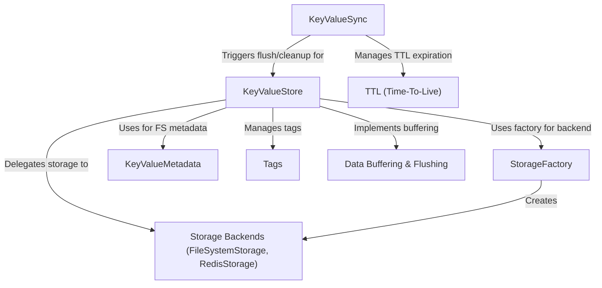

# Tutorial: nadb

NADB is a simple **key-value store** library for Python. Think of it like a dictionary where you can save data using a *key* (a label) and retrieve it later.
It automatically saves your data to disk (*persistence*) or can use faster backends like Redis.
It supports features like adding **tags** to categorize data, setting an expiration time (**TTL**), and handling binary data efficiently.

**Source Repository:** [https://github.com/lsferreira42/nadb](https://github.com/lsferreira42/nadb)

## Chapters

1. [KeyValueStore
](01_keyvaluestore_.md)
2. [Tags
](02_tags_.md)
3. [TTL (Time-To-Live)
](03_ttl__time_to_live__.md)
4. [StorageFactory
](04_storagefactory_.md)
5. [Storage Backends (FileSystemStorage, RedisStorage)
](05_storage_backends__filesystemstorage__redisstorage__.md)
6. [Data Buffering & Flushing
](06_data_buffering___flushing_.md)
7. [KeyValueSync
](07_keyvaluesync_.md)
8. [KeyValueMetadata
](08_keyvaluemetadata_.md)

---
