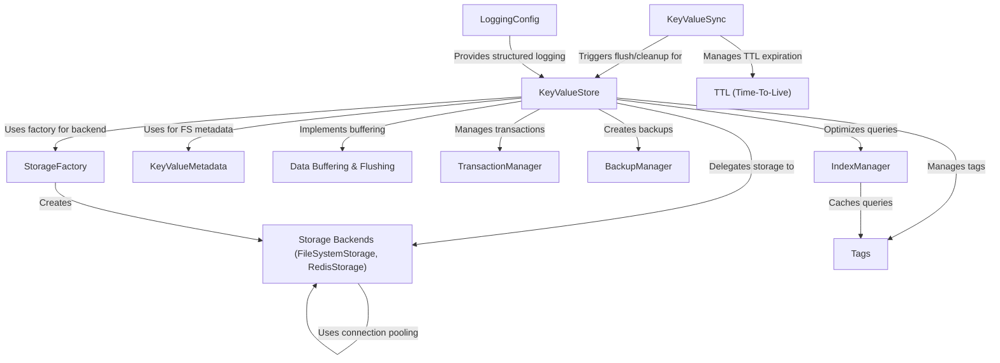

# Tutorial: nadb

NADB is an enterprise-grade **key-value store** library for Python. Think of it like a dictionary where you can save data using a *key* (a label) and retrieve it later.
It automatically saves your data to disk (*persistence*) or can use faster backends like Redis.
It supports features like adding **tags** to categorize data, setting an expiration time (**TTL**), and handling binary data efficiently.

## Security & Stability (v2.1.0)

This version includes important security and stability improvements:

- **Path Traversal Protection** - Filesystem backend validates all paths
- **SQL Injection Prevention** - LIKE patterns are sanitized
- **Input Validation** - All public APIs validate inputs
- **Race Condition Fixes** - Atomic buffer operations
- **Memory Leak Prevention** - Automatic lock cleanup
- **Redis SCAN** - Production-safe key iteration
- **Abstract Storage Interface** - Consistent backend APIs
- **Complete Transaction Rollback** - Restores tags and TTL

## Architecture Improvements (v2.2.0)

Version 2.2.0 introduces a capabilities-based architecture:

- **Backend Capabilities System** - Self-describing backends
- **Unified Write Strategies** - Consistent behavior across backends
- **Automatic Adaptation** - KeyValueStore adapts to backend features
- **Clean Codebase** - No more backend-specific conditionals
- **Easy Extensibility** - Simple to add new storage backends

**Source Repository:** [https://github.com/lsferreira42/nadb](https://github.com/lsferreira42/nadb)

## Chapters

1. [KeyValueStore
](01_keyvaluestore_.md)
2. [Tags
](02_tags_.md)
3. [TTL (Time-To-Live)
](03_ttl__time_to_live__.md)
4. [StorageFactory
](04_storagefactory_.md)
5. [Storage Backends (FileSystemStorage, RedisStorage)
](05_storage_backends__filesystemstorage__redisstorage__.md)
6. [Data Buffering & Flushing
](06_data_buffering___flushing_.md)
7. [KeyValueSync
](07_keyvaluesync_.md)
8. [KeyValueMetadata
](08_keyvaluemetadata_.md)
9. [Advanced Features: Transactions
](09_transactions_.md)
10. [Advanced Features: Backup & Recovery
](10_backup_recovery_.md)
11. [Advanced Features: Indexing & Caching
](11_indexing_caching_.md)
12. [Advanced Features: Structured Logging
](12_structured_logging_.md)
13. [Backend Capabilities System (v2.2.0)
](13_backend_capabilities_system.md)
14. [Network Replication (v2.3.0+)
](14_network_replication.md)

---
